[TOC]

## Kafka介绍

> Apache Kafka是一种分布式的、基于发布/订阅的消息系统，由Scala语言编写而成。它具备快速、可扩展、可持久化的特点。

说明：

1. 与分布式相对的还有主备模式。比如数据库的主备部署，只有主节点提供服务（写入），备节点只是同步数据（只读），主节点挂了以后进行主备倒换，浮动IP飘到备节点。
2. 与发布/订阅相对的还有点对点模式（队列模式）。
3. 既然是分布式系统，那一定满足CAP理论。Kafka中CA的矛盾是这样的，要想实现强一致性（C），leader接收到数据之后，就必须等到所有replica同步过去之后才能响应producer ack。如果replication同步失败，则leader无法响应ack，这就没法实现可用性（A）。kafka 使用ISR实现C 和 A之间的平衡，可对ISR剔除和加入replica的规则参数的配置来动态平衡CA。

### Kafka的关键特性

- 快速：近乎实时的消息处理能力。高效查询和存储消息，批量读写消息，批量压缩消息。顺序读写磁盘。kafka每秒可以处理几十万条消息，它的延迟最低只有几毫秒.

- 可扩展：在线增加分区，在线水平扩展。

- 数据容灾能力：分区可创建多个副本，Leader副本负责读写，Follwer副本与Leader同步。

- 消息分区，一个topic可以有多个partition。同一个分区中消息保序。同一个消费者组中，一个消费者消费一个分区，分区间可并发操作。

### Kafka的应用场景

- 作为传统消息中间件：实现消息队列、消息发布/订阅（常用于消息异步处理、高并发系统的削峰）

- 数据总线：子系统将产生的数据发送到kafka，之后流转到目的系统。（OPS监控系统就是使用kafka作为数据总线，实现模块之间的解耦）

- 日志收集中心

- 运营指标收集

- 基于Kafka设计数据库主从同步工具

### 以Kafka为中心的解决方案特点

- 实现系统间的解耦合（监控系统中，监控消息都上报到Kafka中，再由监控系统统一处理）

- 提供数据持久化能力，包括提供日志清理、日志压缩功能，避免数据不断增长。顺序读写磁盘。

- 支持扩展与容灾
  - 消息冗余备份：每个Topic多个Partition，每个Partition多个Replica（副本）
  - 提高分区数量，可以实现水平扩展。提高副本数量，可以提高容灾能力。
  - 由Consumer决定何时、如何消费消息。Consumer使用pull方式拉取消息，并在Consumer端保存消费的位置。
  - 支持Consumer水平扩展：多个Consumer加入一个Consumer Group。一个Consumer中，每个分区分配给一个Consumer。

- 缓冲&峰值处理能力（把对数据库的写操作作为一个消息写入Kafka，然后实现消费者来读取Kafka消息，进行数据库写入。）

- 异步通信（实现异步接口，通过Kafka消息来获取接口执行结果。）

## Kafka的核心概念

### 消息message

消息是由一串byte数组构成。主要包含key和value（参考发消息的方法send(topic, key, value)）。key可以用来根据一定策略，将消息路由到指定的分区中。

### Topic&分区Partition&Log&Segment

- 同一topic下不同分区消息不同。消息在分区中的唯一编号为offset，offset用于分区内的消息保序。
- 同一topic的不同分区会分配在不同的broker。
- 分区逻辑上对应一个Log，Log可以对应磁盘上一个文件夹。Log由多个Segment组成，每个Segment对应一个日志文件和索引文件。索引文件采用稀疏索引方式。

- 消息保留策略&日志压缩
  - 消息保留策略：kafka有两种消息保留策略，1）根据消息保留的时间。 2）根据Topic存储的数据大小
  - 日志压缩：在后台启动一个线程，定期将key相同的消息合并，只保留最新的value值

### Broker

  - 一个单独的kafka server就是一个broker，生产环境中，一个broker独占一台物理服务器。
  - broker的主要工作：接收生产者发送的消息，分配offset，保存到磁盘。接收消费者和其他broker的请求。

```tex
  replication.factor：partition的副本数量
  unclean.leader.election.enable：leader挂了之后，如何选举leader
```

### 副本replica

kafka实现分布式系统高可靠性的冗余机制。存在的唯一目的就是防止数据丢失。

  - 每个Partition可以有多个副本，副本中的消息是一样的
- Leader副本处理读写请求。
- Follower副本从Leader副本拉取数据，更新到自己的Log中。
- 一般情况下一个分区的多个副本被分配到不同的Broker上。当leader副本所在的broker宕机，kafka从剩余的replica中选举出新的leader继续提供服务。
### ISR集合（In-Sync Replicas 副本同步队列）/AR（Assigned Replicas）所有副本

即目前“可用”且消息量与Leader相差不多的副本集合。  Kafka通过ISR集合，HW和LEO设计解决了同步复制和异步复制两种方案。

ISR集合中的副本需要满足以下两个条件：

  - 副本所在节点必须维持着与Zookeeper的连接
  
  - 副本最后一条消息的offset与Leader副本的最后一条消息的offset之间差值不能超过一定阈值。
```tex
 ISR剔除和加入的规则参数
 rerplica.lag.time.max.ms=10000
  如果leader发现flower超过10秒没有向它发起fech请求，那么leader考虑这个flower是不是程序出了点
  问题或者资源紧张调度不过来，它太慢了，不希望它拖慢后面的进度，就把它从ISR中移除。
 
  rerplica.lag.max.messages=4000 
  相差4000条就移除，flower慢的时候，保证高可用性，同时满足这两个条件后又加入ISR中，在可用性与一
  致性做了动态平衡
```

### HW（High Watermak/高水位）&LEO

  - Leader节点中，HW标记当前能被消费者拉取的最新消息。HW是一个特殊的offset，由Leader副本管理，消费者拉取消息时，只能拉取HW之前的消息。HW之前的消息状态被称为commit，这些消息在多个副本中同时存在。全部的Follower拉取HW指定的消息后，Leader副本递增HW的值。
  - LEO（Log Eng Offset）：每个副本都有，表示当前副本最后一个消息的offset
### 同步复制

  - 所有工作的Follwer副本复制完，才算消息提交成功。一个Follwer故障就会拖垮整个系统。一致性最好，可用性最差。
### 异步复制
- Leader副本收到消息后，就认为消息提交成功。Leader副本宕机会出现消息丢失，状态不可控。
### Cluster&Controller

  - 多个Broker组成一个Cluster
  - 每个Cluster选举一个Broker担任Controller，负责管理分区状态、分区副本状态、监听Zookeeper中数据的变化。
  - Controller Leader、Controller Follower
## 生产者producer

### 生产者的分区（partition）选择策略

1）根据key的hash值。
2）轮询策略。
3）随机策略 
4）按消息键保序策略

### 生产者主要参数

```tex
可靠性一致性调整参数。  
  request.required.asks = 0：不确认，发了就完事，没有可靠性，发送性能最好。
  request.required.asks = 1：leader收到数据就返回ack确认，不能保证flower同步，可能会丢失。至少leader收到了。
  request.required.asks = -1 (all 项目中一般用这个)：要求leader和ISR表中的flower都同步完成才向producer返回ack确
  认，安全性最高，性能最低。Master-Slave模型。
  retries：如果没有ack相应，失败之后重试的次数
```

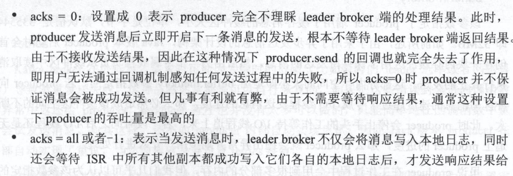

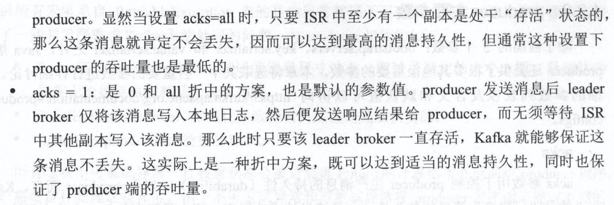

### producer开发

关键字：异步发送，缓冲区，IO线程，数据丢失窗口。

#### 丢消息的原因

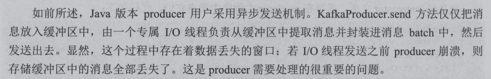

#### 防止消息丢失

- 改为同步发送。性能大大降低，不推荐使用。

- 使用“无消息丢失配置”

  ```tex
  producer无消息丢失配置
  block.on.buffer.full=true 内存缓冲区填满时producer处于阻塞状态，停止接收新消息而不是抛异常。（0.9.0.0）
  max.block.ms.  0.10.0.0以后默认阻塞，只要设置阻塞超时时间？
  acks=all or -1   等到所有follower都响应了发送消息才能认为提交成功。
  retries=Integer.MAX_VALUE   无限重试。
  
  broker端配置
  unclean.leader.election.enable=false  关闭unclean leader选举，不允许非ISR副本被选举为leader，避免broker端因日志水位截断而造成的消息丢失。
  replication.factor=3   3备份原则，即使用多个副本来保存消息。
  min.insync.replicas=2   某条消息至少被写入到ISR中的2个副本才算成功。producer中acks设置为all或-1时才有意义。
  replication.factor>min.insync.replicas  如果相等，则1个副本挂了就无法工作，持久性高，性能低了。
  
  消费者端配置
  enable.auto.commit=false
  ```

#### 消息乱序的原因

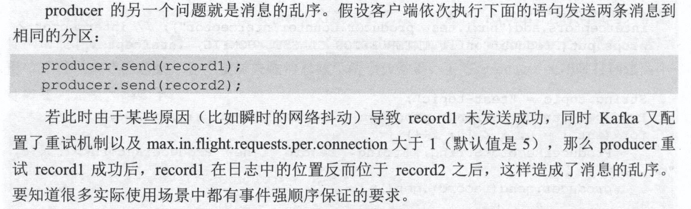

#### 防止消息乱序

  ```tex
  producer防止乱序：
  max.in.flight.requests.per.connection=1  限制producer在单个broker连接上能够发送的未响应请求的数量。防止topic同分区下消息乱序。
  使用带回调机制的send发送消息，即KafkaProducer.send(record, callback)
  Callback失败处理逻辑中显示地立即关闭producer，使用close(0) ： 防止将未完成的消息发送出去
  ```

## 消费者consumer

### consumer主要参数

```tex
必须的4个参数
bootstrap.servers
group.id
key.deserializer
value.deserializer

session.timeout.ms=10 #coordinator检测失败的时间
max.poll.interval.ms=  #consumer处理消息逻辑最大时间

#无位移信息（新建一个consumer group并指定从头消费）或位移越界时Kafka的应对策略。
auto.offset.reset=earliest  #从最早的位移开始消费
auto.offset.reset=latest    #从最新处位移开始消费
auto.offset.reset=none      #抛出异常

#consumer是否自动提交位移
enable.auto.commit=false  #有较强“精确处理一次”语义需求时使用
enable.auto.commit=true

heartbeat.interval.ms    #心跳间隔时间，必须小于session.timeout.ms
```

  - 消费者提交offset到offsets topic（__consumer_offsets），消费者上下线时，执行consumer group rebalance操作，分区重新分配后，消费者可以读取offsets topic中记录的offset。
  - 消费者提交offset的方式有：自动提交offset、手动同步提交、手动异步提交（消费者自己维护所消费分区的offset）
### 位移offset

kafka中的位移有两种

- consumer中的offset，消费该partition的消费者也有一个位移，随着消费进度不断前移。
- 分区日志中的offset，topic partition 下每条消息都会被分配一个位移，这个位移是固定的。

## 消费者组Consumer Group

### 什么是消费者组

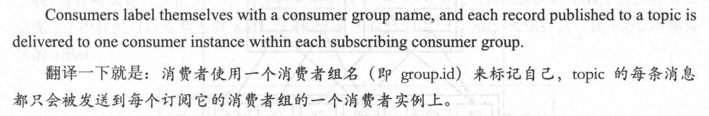

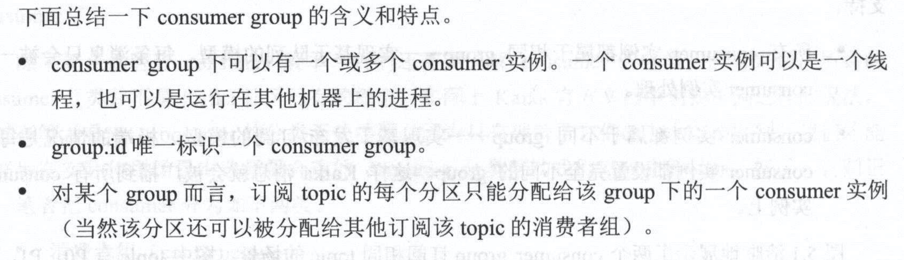

  - Group用于实现消息的广播（所有消费者不同的group）、独占模式（所有消费者一个group）
  - 实现消费者水平扩展（高伸缩性）、故障转移（高容错性）
  - group内，一个分区一个consumer消费。一个consumer可消费多个分区。

### 基于对列/基于发布订阅消息引擎模型

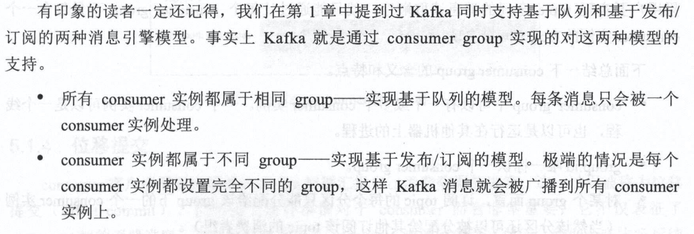

### 重平衡（rebalance）

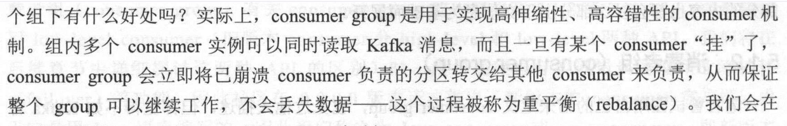

（1）Consumer增加或删除会触发 Consumer Group的Rebalance 

（2）Broker的增加或者减少都会触发 Consumer Rebalance

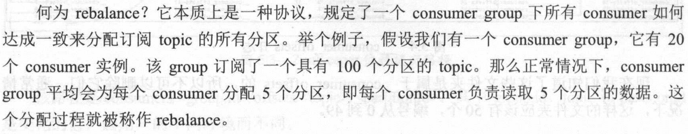

### 生产者发送消息过程

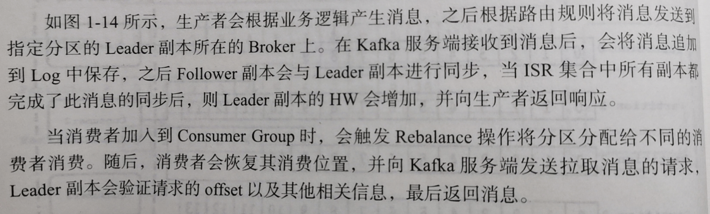

### 消息顺序

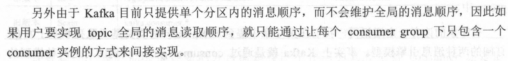

## kafka的高性能

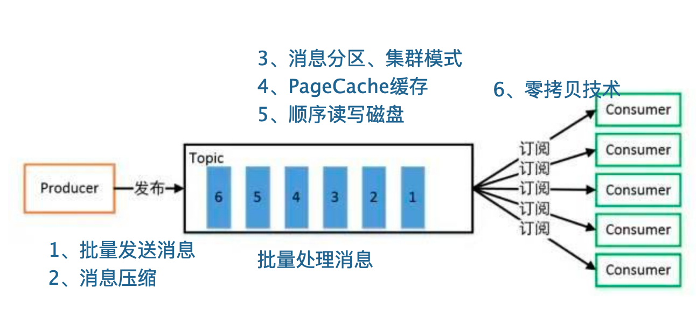

### 消息分区

生产者消息分区。Kafka的消息组织方式实际上为一个3级结构，topic、分区、消息。对同一个topic下的数据进行分区，不同的分区可以放置到不同的机器节点上，消息的读写以分区为单位进行。分区可提升集群的可伸缩性、进行负载均衡，提高吞吐量。（分而治之）

### 消息压缩

消息压缩，通过生产者端一定的CPU消耗，来减少Broker端的磁盘空间消耗和网络传输带宽。可以在生产者和Broker端指定压缩策略。（压缩算法：GZIP、zstd 压缩（建议）。）

### PageCache

Cache Filesystem Cache PageCache缓存：使用操作系统页缓存来存储数据。避免在JVM内部缓存数据。

### 顺序读写磁盘

顺序读写磁盘，加快消息从磁盘写入和读取： 由于现代的操作系统提供了预读和写技术，磁盘的顺序写大多数情况下比随机写内存还要快。

### 零拷技术

Zero-copy 零拷技术加快消费：服务端处理消费消息的逻辑是：文件 -- PageCache -- 应用程序内存 --Socket缓冲区。使用零拷贝技术时，直接把PageCache 中数据复制到 Socket 缓冲区。由于不用把数据复制到用户内存空间，DMA 控制器可以直接完成数据复制，不需要 CPU 参与，速度更快。

### 批量量处理消息

Batching of Messages 批量量处理，批量发送和处理消息。合并小的请求，然后以流的方式进行交互，直顶网络上限。客户端发送请求时，kafka先把消息存入缓存，然后异步批量发送。

### Pull 拉模式 

使用拉模式进行消息的获取消费，与消费端处理能力相符。

## Kafka的高可靠性（消息持久化、消息不丢失、不重复）

### 传递保证语义

1. <= 1 (At most once/不重复) 

   消费者拉取消息后，**先提交offset，再处理消息**。可能会导致消息丢失。

2. / >=1（At least once/不丢失）

   消费者拉取消息后，**先处理消息，再提交offset**。可能会导致消息重复处理。

3. ==1（Exactly once/不重复/不丢失）

   1. 生产者不产生重复消息，生产者不丢失消息。
      1. 一个分区一个生产者写入，异常时，生产者查询此分区最后一个消息，决定是否重传。
      2. **为每个消息添加一个全局唯一主键，异常时，生产者可以重传消息，消费者根据主键对消息去重。（当业务消息有合适的主键，或用一个全局ID生成器生成唯一主键）**
      3. 对生产者、broker进行无消息丢失配置。（参考前文）
   3. 消费者不能重复拉取相同的消息。
      1. 消费者关闭自动提交offset的功能，且不再手动提交offset，这样就不使用offsets topic这个内部topic记录其offset，而由消费者自己保存offset。利用事务的原子性来实现exactly once语义。将offset和消息处理结果放到一个事务中，事务执行成功则认为此消息被消费，事务回滚则需要重新消费。当消费者宕机重启或rebalance操作时，消费者从关系型数据库中找到对应offset，然后调用KafkaConsumer.seek方法手动设置消费位置，进行消费。会导致复杂度增大。
      2. ConsumerRebalanceListener
         1. onPartitionRevoked：在拉取数据之后，rebalance开始之前手动提交offset
         2. onPartitionAssigned:在Rebalance之后，拉取数据之前，调整topic。

## Kafka的其他应用

### ZooKeeper在Kafka中的使用

Kakfa Broker Leader的选举： Kakfa Broker集群受Zookeeper管理。所有的Kafka Broker节点一起去Zookeeper上注册一个临时节点，因为只有一个Kafka Broker会注册成功，其他的都会失败，所以这个成功在Zookeeper上注册临时节点的这个Kafka Broker会成为Kafka Broker Controller，其他的Kafka broker叫Kafka Broker follower。（这个过程叫Controller在ZooKeeper注册Watch）。[Kafka史上最详细原理总结 ----用于自己看的](https://blog.csdn.net/lingbo229/article/details/80761778)

## Mac安装Kafka

```tex
==> zookeeper
To have launchd start zookeeper now and restart at login:
  brew services start zookeeper
  
Or, if you don't want/need a background service you can just run:
  zkServer start
  
==> kafka
To have launchd start kafka now and restart at login:
  brew services start kafka
  
Or, if you don't want/need a background service you can just run:
  zookeeper-server-start -daemon /usr/local/homebrew/Homebrew/etc/kafka/zookeeper.properties & kafka-server-start /usr/local/homebrew/Homebrew/etc/kafka/server.properties
```

## 常见问题

### kafka生产者怎么保证消息有序，怎么保证消息不丢失，消息不重复？

1. 消息无序的原因是什么？
2. 什么情况下会丢失消息，产生重复消息？

### kafka消费者怎么保证消息有序，消息不丢失，消息不重复

1. 拉取消息的超时机制知道吗
2. offset保存在哪里
3. 消费者的心跳

### kafka server怎么保证消息不丢失的

副本、Log

### kafka怎么为comsumer group中的成员分配分区

rebalance重平衡操作。

## 参考

[15 | Kafka如何实现高性能IO？](https://time.geekbang.org/column/article/126493)

[Kafka核心技术与实战](https://time.geekbang.org/column/intro/100029201)

[《Apache Kafka 源码剖析》](https://book.douban.com/subject/27038473/)

[kafka：简介、使用场景、设计原理、主要配置及集群搭建](https://www.cnblogs.com/likehua/p/3999538.html)

[消息中间件（一）MQ详解及四大MQ比较](https://blog.csdn.net/wqc19920906/article/details/82193316/)


## 云原生消息队列服务

[字节跳动新一代云原生消息队列实践](https://blog.csdn.net/weixin_46399686/article/details/135975591)