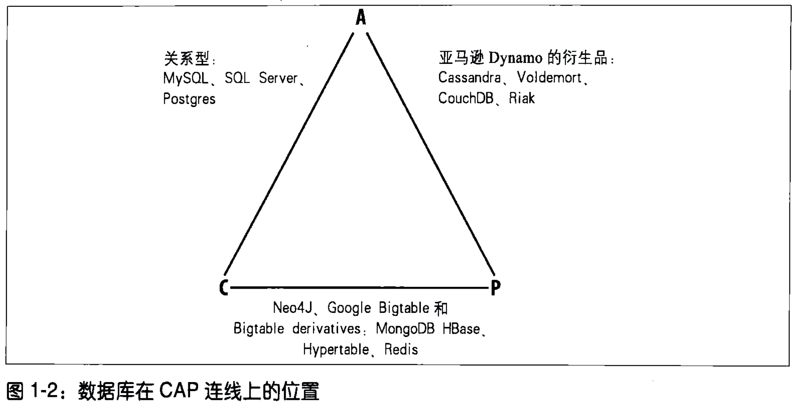
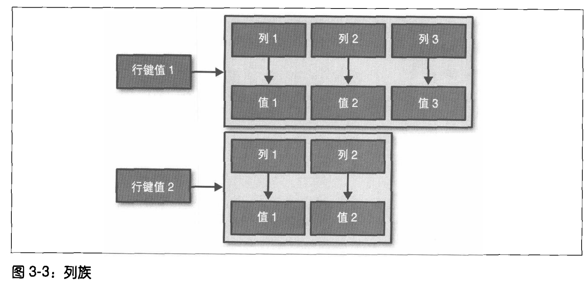
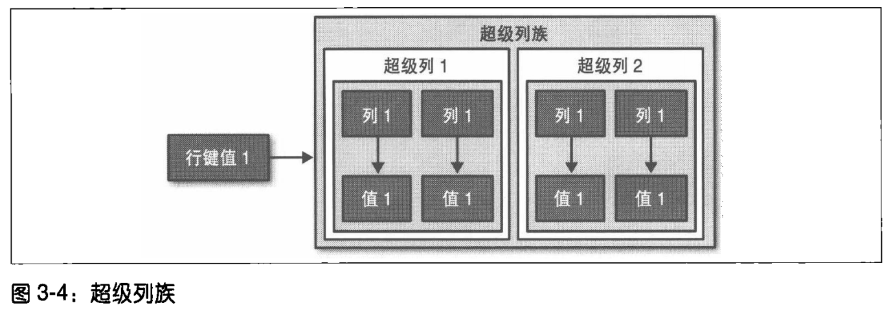
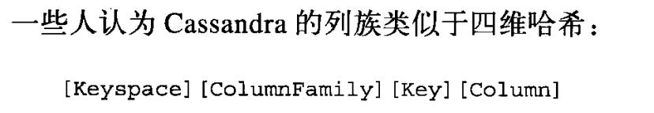

[TOC]

## 第一章 Cassandra概况

### Cassandra的主要特点

Apache Cassandra是一个开源的、分布式、无中心、弹性可扩展、高可用、容错、一致性可调、面向列的数据库，它基于Amazon Dynamo的分布式设计和Google BigTable的数据模型。

1. 分布式与无中心
2. 弹性可扩展
3. 高可用与容错
4. 可调节的一致性
5. 面向行
6. 无schema
7. 高性能

### Cassandra的应用场景

1. 大规模部署
2. 写密集、统计和分析型工作
3. 地区分布
4. 变化的应用

单节点关系数据库无法满足需要时，当至少需要几个数据库节点才能支撑业务时，考虑Cassandra。

支撑应用负载需要很高的多客户线程并发写性能。

数据多地分布（多个数据中心）

无Schema的数据模型

## 第三章 Cassandra的数据模型

Cassandra的数据结构是一个多维稀疏哈希表。

稀疏意味着任何一行都可能会有一列或者几列，但每行都不一定和其他行有一样的列。

每行都有一个唯一的键值，用于进行数据访问。

### 自底向上的Cassandra的数据模型

#### 列

列名/值对

#### 时间戳

记录了列上一次被更新的时间，客户端写数据的时候必须要同时提供时间戳的值。时间戳仅用于在服务端解决冲突。

#### 行

每个拥有某组列的集合的对象

#### 行键值

每个行的唯一标识。行键值和列名可以是字符串，也可以是其他类型。

#### 列族

逻辑上的分组，为具有相似但不同列集合的行而准备的容器。一个列族大致类似于关系数据库领域的一张表。

列族1

​	行1

​		key：value（列1）

​		key2: value2（列2）

​	行2

​		key：value（列1）

列族2

​	行1

​		key：value（列1）

**总结：列是键值对，行是多个列，列族是多个行。**

#### 超级列族

超级列族中的列还包含一组子列，寻址需要行键值、列名和子列的名称。

### 自顶向下的Cassandra结构

#### 集群/环（ring）

Cassandra将集群中的节点组织成一个环，依此来分配数据到集群中的节点上。

#### P2P协议

允许数据以对用户透明的方式在节点间互相复制。

#### keyspace

keyspace是Cassandra的外层容器，keyspace包含了若干列族。keyspace在逻辑上是容纳列族和某些配置属性的命名空间。

##### 副本因子

所有节点中存放的相同数据的副本数量。每行数据会复制到多少个节点上。加上原数据，有N+1个节点有数据？副本因子越大，为一致性需要付出更多的性能代价。

##### 副本放置策略

##### 列族

### 列族

每个列族在磁盘上都存储为不同的文件，所以要把相关的列放在同一个列族中。

同一行的所有数据必须存放在集群中的同一台机器上。行键值决定了防止数据副本的位置。

### 列

列是由名称、值和时钟（时间戳）构成的三元组。

与关系型数据库的区别：

关系型数据库：预先定义所有列的名字，写的时候根据定义好的数据结构提供值。

Cassandra：无需预先定义列，在keyspace里定义列族就可以开始写数据。所有列的名字由客户端提供。数据模型可随着时间推移来循序渐进地改变。

## 第五章 Cassandra的架构

### system keyspace

system是Cassandra的一个内部keyspace，用于存储关于集群的元数据，无法手动修改。存储的元数据包括：

- 节点令牌
- 集群名
- 用于支持动态装载的keyspace和schema的定义
- 迁移数据
- 节点是否自举成功

### 对等结构（P2P）

传统的多节点部署的数据库，比如mysql，用的是主/从副本复制模式。数据变更都需要经过主节点，从节点与主节点进行数据同步。客户端可以从任意一个从节点读取信息。主节点会有单点故障。

Cassandra采用对等结构（P2P）的分布式模型。集群中所有节点地位相同，提高了集群的可用性和可扩展性。

### gossip与故障检测

gossip协议常用于大规模、无中心的网络系统，常作为分布式数据库中的一种自动数据副本复制机制。Cassandra使用gossip协议来进行环内通信，每个节点都会有其他节点的状态信息。当一个节点发现另一个节点重新上线时，gossip自动触发提示移交。

Cassandra的gossip会用于故障检测，使用Phi增量故障检测算法，会在死活两个极端之间寻找一个中间位置--嫌疑级别。优点是考虑了网络环境的波动性。嫌疑级别基于心跳的采样来判断故障的可能性。

传统故障检测方法是使用“心跳”机制来判断节点是否已死。

### 逆熵与读修复

逆熵是Cassandra的副本同步机制。Merkle树（列族数据的一个哈希表示）

读修复会更新过时的数据。

### memtable、SSTable和commit log（读、写过程）

写操作时，数据直接写入commit log。commit log是Cassandra为了达到持久性而引入的一种错误恢复机制。写操作只有写入到commit log才被认为是成功。数据写入commit log之后，会写入memtable内存数据结构。当memtable之中存储的对象数量达到阈值之后，memtable会被刷入磁盘，放在一个称为SSTable的文件中。然后，创建一个新的memtable，接收数据。

SSTable磁盘上的文件（Sorted String Table，有序字符串表）。

每个SSTable有一个关联的Bloom filter用以提高性能（减少磁盘访问次数）。

读操作，Cassandra首先检查memtable来查找值。

### 提示移交

### 压紧

压紧操作用于合并SSTable。压紧操作过程中，SSTable中的数据会被合并：键值合并，列组合在一起，丢弃墓碑，创建新的索引。

### Bloom filter

减少查找键值时的磁盘访问次数，而改善性能。

### 墓碑（删除操作）

执行删除操作时，数据不被立刻删除，而是视为一个更新操作，在对应值上放一个墓碑，表示一个删除标记，执行压紧时，比墓碑更老的内容会被清理。

### 分阶段事件驱动架构
