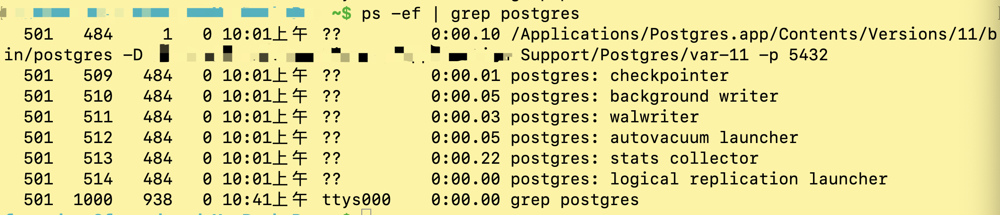
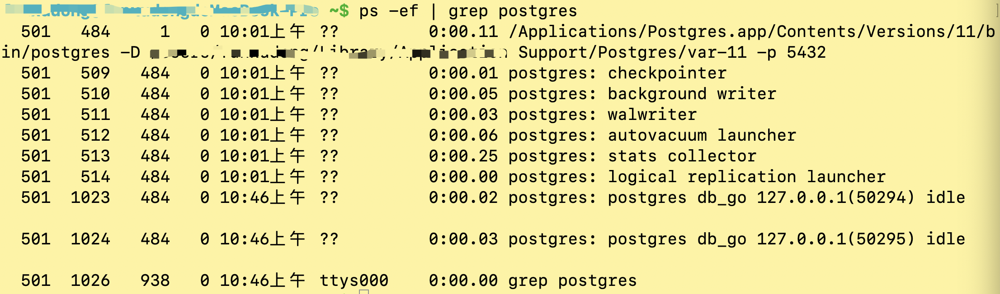
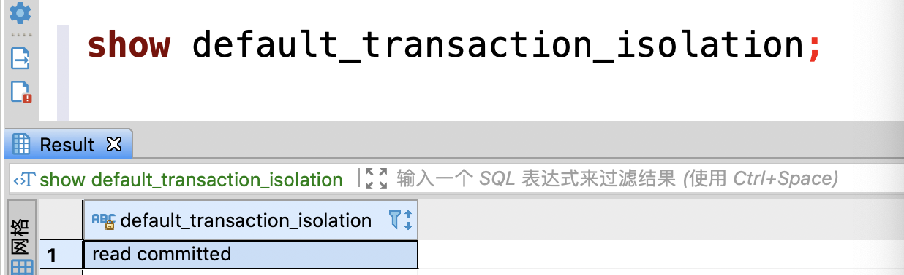

[TOC]

## PostgreSQL与Mysql的区别

在使用上其实我们最关注的是数据类型、索引类型，这些涉及到表创建的东西。然后再关注他们底层实现的区别。

### Mysql多线程、PG多进程。

Postgresql使用多进程架构实现，PG启动时会拉起守护进程，然后由守护进程fork相关的后台辅助进程。

守护进程的另一个作用是监听客户端的连接请求，当client发起连接时，守护进程会fork服务进程来处理client发送过来的命令，每有一个连接，后台就会存在一个服务进程。

PG使用共享内存作为主要的数据共享、进程通信的方式。PG在共享缓冲区内实现了锁、vacuum、两阶段事务管理等等功能。

主要进程：

1. logger process：日志进程
2. checkpointer：检查点进程，检查的作用主要是缩短数据库恢复的时间。
3. walwriter：预写式日志写进程。
4. autovacuum launcher：自动清理进程。自动执行`VACUUM`和`ANALYZE`命令。
5. stats collector：状态收集进程。收集一些关于服务器运行的信息，包括表的访问次数，磁盘的访问次数等信息。收集到的信息除了能被autovaccum利用，还可以给其他数据库管理员作为数据库管理的参考信息。  






#### 多线程和多进程的比较

1. 进程模式对多CPU利用率比较高。
2. 进程模式共享数据需要用到共享内存，而线程模式数据本身就是在进程空间内都是共享的，不同线程访问只需要控制好线程之间的同步。线程模式共享数据更快更方便。
3. 线程模式对资源消耗比较少。所以MySQL能支持远比PostgreSQL多的更多的连接。但PostgreSQL中有优秀的连接池软件软件，如pgbouncer和pgpool，所以通过连接池也可以支持很多的连接。

### MySQL 24*7运行，PG不是

1. MySQL可以适应24/7运行。在绝大多数情况下，你不需要为MySQL运行任何清除程序。
2. PostgreSQL目前仍不完全适应24/7运行，这是因为你必须每隔一段时间运行一次VACUUM。


### 数据类型比较（Postgresql比Mysql丰富）

#### Mysql

[MySQL 数据类型](https://www.runoob.com/mysql/mysql-data-types.html)

- 数值类型
- 日期和时间类型
- 字符串类型

#### Postgresql

[PostgreSQL 数据类型](https://www.runoob.com/postgresql/postgresql-data-type.html)

- 数值类型
- 货币类型
- 字符类型
- 日期和时间类型
- 布尔类型
- 枚举类型
- 几何类型
- 网络地址类型
- JSON类型
- 数组类型


### 索引

#### Postgresql的索引类型

- BTREE

  - 索引字段长度超过1/3索引页的大小，创建索引时会报错。
  - 技术上是B+树结构
  - High Key：B+树的每一个节点都有一个High-Key值，此值表示此节点或者此节点的子节点的最大值。

- 哈希索引（HASH）

Postgresql添加索引

  - sql语法参考：https://www.postgresql.org/docs/current/sql-createindex.html
  - 当不指定索引方法时，默认为BTREE。其他包括哈希索引、全文索引等。


3、锁

乐观锁MVCC的实现上。MySQL的innodb引擎或者Oracle数据库都是将旧版本的数据放到undo段中的，一个事务如果想读取旧版本的数据就从这个地方将数据读出来。PostgreSQL旧版本的数据不删除，插入新数据；旧数据确认没有用时再由autovacuum来清理。

PG实现方式的优势： 1、由于旧版本的数据不在undo段中，数据的更改记录都在表文件中，所以PostgreSQL数据库事务发生回滚可以立即完成(不论这个事务是不是大事务)。 2、数据能够进行大量的更新，不像MySQL的innodb引擎和Oracle数据更新先将更改前的数据放到undo空间中去(undo空间的暴增数据库性能会很差，所以不能肆无忌惮的更新数据)。

 劣势； 1、大量的旧版本数据占用磁盘空间降低了查询性能(需要扫描更多的数据块) 2、事务ID个数有限制


4、使用上

PG更加试用于简单的场景

PostgreSQL只支持堆表，不支持索引组织表，Innodb只支持索引组织表。

索引组织表的优势：表内的数据就是按索引的方式组织，数据是有序的，如果数据都是按主键来访问，那么访问数据比较快。而堆表，按主键访问数据时，是需要先按主键索引找到数据的物理位置。
索引组织表的劣势：索引组织表中上再加其它的索引时，其它的索引记录的数据位置不再是物理位置，而是主键值，所以对于索引组织表来说，主键的值不能太大，否则占用的空间比较大。
对于索引组织表来说，如果每次在中间插入数据，可能会导致索引分裂，索引分裂会大大降低插入的性能。所以对于使用innodb来说，我们一般最好让主键是一个无意义的序列，这样插入每次都发生在最后，以避免这个问题。
由于索引组织表是按一个索引树，一般它访问数据块必须按数据块之间的关系进行访问，而不是按物理块的访问数据的，所以当做全表扫描时要比堆表慢很多，这可能在OLTP中不明显，但在数据仓库的应用中可能是一个问题。

## PostgreSQL支持的分区类型	

- Range Partitioning
  The table is partitioned into “ranges” defined by a key column or set of columns, with no overlap between the ranges of values assigned to different partitions. For example, one might partition by date ranges, or by ranges of identifiers for particular business objects.

范围分区表：在创建时，就要指定各个分区的范围和分区名称。或者在创建完主分区表后，手动创建分表。当插入的数据不在任何分区时会报错。也可以新增日期字段，在存入数据时，通过时间戳计算出当前日期，从而改用分区表。

```
CREATE TABLE measurement (
    city_id         int not null,
    logdate         date not null,
    peaktemp        int,
    unitsales       int
) PARTITION BY RANGE (logdate);
```

```
CREATE TABLE measurement_y2006m02 PARTITION OF measurement
    FOR VALUES FROM ('2006-02-01') TO ('2006-03-01');
```

- List Partitioning
  The table is partitioned by explicitly listing which key values appear in each partition.

- Hash Partitioning
  The table is partitioned by specifying a modulus and a remainder for each partition. Each partition will hold the rows for which the hash value of the partition key divided by the specified modulus will produce the specified remainder.


## 事务隔离级别

默认是已提交



## 参考

[PostgreSQL与MySQL对比](https://blog.csdn.net/tiandao2009/article/details/79839037?ops_request_misc=%7B%22request%5Fid%22%3A%22161689709616780262534604%22%2C%22scm%22%3A%2220140713.130102334..%22%7D)

[Postgresql进程与内存结构](https://blog.csdn.net/jackgo73/article/details/105303194?ops_request_misc=%257B%2522request%255Fid%2522%253A%2522161689856316780264087012%2522%252C%2522scm%2522%253A%252220140713.130102334..%2522%257D&request_id=161689856316780264087012&biz_id=0&utm_medium=distribute.pc_search_result.none-task-blog-2~all~sobaiduend~default-1-105303194.first_rank_v2_pc_rank_v29&utm_term=postgresql+%E5%A4%9A%E8%BF%9B%E7%A8%8B)

[深入浅出PostgreSQL之浅谈MVCC](https://blog.csdn.net/ancang1868/article/details/101684740?ops_request_misc=%257B%2522request%255Fid%2522%253A%2522161690045716780255216968%2522%252C%2522scm%2522%253A%252220140713.130102334..%2522%257D&request_id=161690045716780255216968&biz_id=0&utm_medium=distribute.pc_search_result.none-task-blog-2~all~sobaiduend~default-5-101684740.first_rank_v2_pc_rank_v29&utm_term=%E6%B7%B1%E5%85%A5%E6%B5%85%E5%87%BAPostgreSQL)

