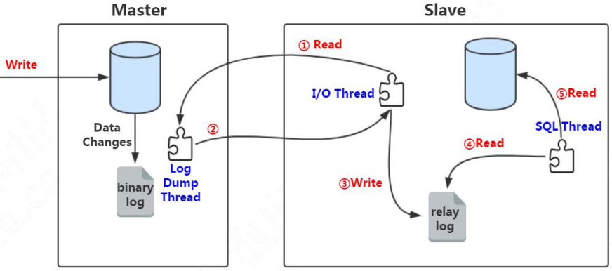

[TOC]

数据库分类

- 关系型数据库，它最典型的数据结构是表，由二维表及其之间的联系所组成的一个数据组织。常见的是mysql、postgresql等。

- 非关系型数据库，数据结构化存储方法的集合，可以是文档或者键值对等。一般没有事务功能，又称为Nosql。常见的是用go语言实现的etcd、用c语言实现的redis（常用作分布式缓存，cookie，存在超时机制）、Hbase 、时序数据库influxdb。

  

MySQL最重要、最与众不同的特性是它的存储引擎架构：将查询处理及其他系统任务和数据的存储/提取相分离。它可以为每张表选择合适的存储引擎。即事务型表（InnoDB）、非事务型表（MyISAM）。


- MyISAM存储引擎，索引文件和数据文件分离(即非聚集的)，索引文件保存在磁盘上，仅仅保存数据记录的地址。
- InnoDB存储引擎，InnoDB数据文件本身按主键聚集。即通过主键索引组织表，表根据主键顺序以索引的形式存放。主键索引的叶子结点保存了完整的一行数据记录，这种索引也称为聚集索引。而普通索引树的叶子节点则存放主键值。索引使用B+树结构，主键会自动创建唯一索引。生产一个主键索引树。


数据库逻辑架构图

常见的数据库客户端有：1、DBeaver、pgadmin、navicat 2、jdbc：JDBC是目前最为通用的java和数据库的交互技术。常见的开源框架都构建在JDBC之上。 3、psql、mysql命令（客户端工具）


MySQL服务器3层逻辑架构图：服务器层（连接器包括在server层）、存储引擎层。

服务层：实现MySQL的核心服务功能，连接器（长连接、session闲置超时时间）；查询缓存（更新语句执行时，表上所有查询缓存都会失效，所以查询缓存只适用于静态表，必需系统配置。Mysql 8.0 没有查询缓存功能。）；分析器（词法分析、拆解字符串，识别出关键字，表名，字段等）；语法分析（校验sql语法，提示错误的语法。）；优化器（选择索引）；执行器（权限校验、调用引擎的接口、如果没有索引，则会全表扫描。、慢查询日志中记录扫描行数）

引擎层：负责将数据写入磁盘和读取，为server层提供数据；实现索引，当有索引时，进行树的搜索。提供事务相关接口给执行器。


## 主键

唯一标识表中每行的这个列或这组列称为主键。主键用来表示一个特定的行。**没有主键，更新或删除表中特定行很困难，因为没有安全的方法保证只涉及相关的行。**


## 数据库事务的ACID特性

- A 原子性：一个事务必须被视为一个不可分割的最小工作单元，整个事务中的所有操作要么全部提交成功，要么全部失败回滚，对于一个事务来说，不可能只执行其中的一部分操作。
- C 一致性：数据库总是从一个一致性的状态转换到另外一个一致性的状态。如果系统崩溃，事务没提交就不会出现中间状态。
- I 隔离型：通常来说，一个事务所做的修改在最终提交以前，对其他事务是不可见的。通过事务隔离级别进行控制。
- D 持久性：一旦事务提交，则其所做的修改就会永久保存到数据库中。此时，即使系统崩溃，修改的数据也不会丢失。实际上不可能做到100%持久性，这也是备份存在的意义。

## 数据库事务的ACID实现原理

- A：原子性(Atomicity)：通过undo log回滚日志实现，undo log记录数据被修改前的信息，即修改前表的字段值，当发生错误或者执行rollback操作时，用于回滚操作，保障未提交事务的原子性。事务开始后，每次数据变更都伴随着undo log的产生，undo log会先于数据持久化到磁盘上。
- C：一致性(Consistency)：原子性、隔离性、持久性最后是为了保证一致性。
- I：隔离性(Isolation)：通过读写锁和MVCC来实现的，MVCC又依赖undo log和read view。锁和MVCC的实现在后面说。
- D：持久性(Durability)：通过redo log重做日志实现，redo log记录数据被修改后的信息（？？记录的具体是啥），当数据库异常重启时，用来恢复数据，保障已提交事务的持久性。redo log包括重做日志缓冲redo log buffer和重做日志文件redo log两部分，后台线程从redo log buffer同步数据到redo log即磁盘上。redo log为顺序存储，I/O效率高。mysql表数据存在磁盘上，innodb为了提升性能提供了缓存池buffer pool，读数据先读缓存，没有则从数据库读后放入磁盘。写输入先写缓存，缓存定期同步到磁盘。修改表数据时只修改内存，修改行为记录到磁盘上的事务日志（redo log？），事务日志采用追加方式写入，即使用顺序I/O加快机械磁盘写入效率。


## SQL标准中定义的四种事务隔离级别，及其实现原理

隔离级别规定了一个事务中所做的修改，哪些在事务内和事务间是可见的，哪些是不可见的。是数据可靠性和性能之间的权衡。

- read uncommitted（未提交读/读未提交）：一个事务还没提交时，它做的变更就能被别的事务看到，即事务总是读取最新的行。会产生脏读，即读取到未提交的数据，很少使用的一种隔离级别。
- Read committed（提交读）：一个事务提交之后，它做的变更才会被其他事务看到。解决了脏读问题，但还是会出现不可重复读和幻读，不可重复读即读取其他事务已提交的数据，导致同一个事务中前后两次相同查询的结果不同。
- repeatable read（可重复读）：一个事务执行过程中看到的数据，总是跟这个事务在启动时看到的数据是一致的。当然在可重复读隔离级别下，未提交变更对其他事务也是不可见的。可能会有幻读，即A事务读取B事务提交的新增数据，修改的已提交数据不会被读到，新增数据就像一个幻像。InnoDB通过多MVCC解决幻读问题，是MySQL默认事务隔离级别
- Serializable（可串行化）：顾名思义是对于同一行记录，“写”会加“写锁”，“读”会加“读锁”。当出现读写锁冲突的时候，后访问的事务必须等前一个事务执行完成，才能继续执行。会对所有读取的行都加锁。

在实现上，数据库里面会创建一个视图，访问的时候以视图的逻辑结果为准。在“可重复读”隔离级别下，这个视图是在事务启动时创建的，整个事务存在期间都用这个视图。在“读提交”隔离级别下，这个视图是在每个 SQL 语句开始执行的时候创建的。这里需要注意的是，“读未提交”隔离级别下直接返回记录上的最新值，没有视图概念；而“串行化”隔离级别下直接用加锁的方式来避免并行访问。


这里的视图注意和另一个视图的区别。在 MySQL 里，有两个“视图”的概念：

一个是 view。它是一个用查询语句定义的虚拟表，在调用的时候执行查询语句并生成结果。创建视图的语法是 create view … ，而它的查询方法与表一样。

另一个是 InnoDB 在实现 MVCC 时用到的一致性读视图，即 consistent read view，用于支持 RC（Read Committed，读提交）和 RR（Repeatable Read，可重复读）隔离级别的实现。


mysql查看当前事务隔离级别

```sql
show variables like 'transaction_isolation';
```


## MySql锁技术

根据加锁的范围，Mysql里面的锁大致可以分为全局锁、表级锁和行级锁三类。

全局锁对整个数据库实例加锁。Mysql加全局锁的命令是Flush tables with read lock (FTWRL)，加锁后整个库进入只读状态，可通过unlock tables释放锁。MyISAM这种不支持事务的引擎，可通过FTWRL加全局锁做全库逻辑备份。如果所有表使用事务引擎InnoDB，则可以使用官方自带逻辑备份工具mysqldump使用参数single-transaction，导数据前启动一个事务来拿到一致性试图来备份数据，不用加全局锁（底层通过MVCC实现）。set global readonly=true也可以设置数据库为只读，常用来将备库设置为只读，与FTWRL不同它不会因为客户端发生异常而取消只读。

Mysql里面表级锁有两种，表锁和元数据锁（meta data lock，MDL）。表锁通过lock tables xxx read/write添加，通过unlock tables释放锁，客户端断开时也会自动释放。表锁会限制本线程和其他线程对表的操作。InnoDB支持行锁，所以一般不使用表锁来控制并发。Mysql 5.5中引入MDL元数据锁，在访问一个表时自动加上。事务中的MDL锁，在语句开始执行时申请，事务提交后释放。MDL锁用于保证读写正确性。即增删改查表时，不会因为其他线程对表结构做了变更而导致查询结果和表结构对不上。表的增删改查加MDL读锁，表结构变更加DML写锁。（读写锁是根据锁锁住的操作类型来分的，mysql使用读写锁组合来对读写请求进行控制，读锁又称共享锁，多个读请求可共享一把锁读数据而不阻塞。写锁又称排他锁，写锁与其他所有锁请求互斥。）MDL写锁会阻塞后续的读操作，因此给一个小表加字段时，要先从MySQL 的 information_schema 库的 innodb_trx 表中查看当前执行中的事物中是否有所要变更表的长事务，有的话先不加字段或kill这个长事务后再加。如果表的请求频繁kill长事务不管用，则可以在alter table语句里设定等待时间，防止阻塞后续业务语句。

行锁是针对数据库表中行记录的锁。行锁在引擎层实现，MyISAM不支持行锁，InnoDB支持。在InnoDB事务中行锁是在需要的时候才加上的，并在事务结束时释放，即两阶段锁协议。如果需要在事务中锁多个行，要把最可能造成锁冲突的行放最后，来减少这一行锁住的时间。当两个事务中，各自锁住了一行，又去申请对方事务锁住的行时，会产生死锁。当出现死锁时，有两种策略。第一种是等待超时，innodb_lock_wait_timeout可以设置超时时间。一种是开启死锁检测，innodb_deadlock_detect设为on，发现死锁后会主动回滚死锁链中某个事务，让其他事务继续执行。死锁检测比较耗费CPU，有3中解决方法，1是关闭死锁检测，2是在数据库服务端控制并发度，3是将一行数据改成逻辑上的多行来减少锁冲突。

间隙锁在Repeatable read隔离级别下使用，可以防止幻读。当我们用范围条件检索数据，并请求锁时，InnoDB会给符合范围条件的已有数据记录的索引项加锁；对于键值在条件范围内但并不存在的记录，叫做“间隙（GAP)”，InnoDB也会对这个“间隙”加锁。


乐观锁，并没有对数据库加锁，它是通过给表添加一个版本字段version，每次更新数据前先查出当前version，更新时对version+1，并在增加条件where version = 所查出的值。即update A set name = ‘xxx’, version = version + 1 where id = x and version = x;

悲观锁（select * from x x x for update）

[Mysql数据库锁之---表级锁、行级锁、悲观锁、乐观锁、间隙锁GAP、死锁等简单介绍](https://blog.csdn.net/With_Her/article/details/81535813)

## 多版本并发控制（MVCC）

InnoDB的实现：在每行记录后面保存行的创建时间和行的过期时间（删除时间），即系统版本号。每开始一个事务系统版本号递增，并作为事务的版本号。（类似于事务ID设计）

mysql中mvcc实现依赖undo log 与read view，undo log中记录某行数据的多个版本，read view用来判断当前版本数据的可见性。当系统判断没有比undo log更早的read-view时将其删除

mvcc不同于乐观锁，乐观锁通过cas实现，mvcc是基于快照的无锁隔离机制。


在实现上， InnoDB 为每个事务构造了一个数组，用来保存这个事务启动瞬间，当前正在“活跃”的所有事务 ID。“活跃”指的就是，启动了但还没提交。数组里面事务 ID 的最小值记为低水位，当前系统里面已经创建过的事务 ID 的最大值加 1 记为高水位。这个视图数组和高水位，就组成了当前事务的一致性视图（read-view）。


## Mysql中的复制

《高性能mysql》 第10章复制学习

关键词：水平扩展、主库、备库、二进制日志Binary log、中继日志Relay log、重放

Mysql支持基于行的复制和基于语句的复制两种复制方式。都是通过在主库上记录二进制日志、在备库重放日志的方式来实现异步的数据复制。



如上图所示，在主从复制中，更新语句会记录 binlog，前面我们说过它是一种逻辑日志。有了这个 binlog，从服务器会获取主服务器的 binlog 文件，然后解析里面的 SQL语句，在从服务器上面执行一遍，保持主从的数据一致。这里面涉及到三个线程，连接到 master 获取 binlog，并且解析 binlog 写入中继日志，这个线程叫做 I/O 线程；Master 节点上有一个 log dump 线程，是用来发送 binlog 给 slave 的；从库的 SQL 线程，是用来读取 relay log，把数据写入到数据库的。 如果数据库做了主从复制后，我们只需要把数据写入主节点，而从节点分担读的请求，这种方法我们也可以叫做读写分离。读写分离可以一定程度低减轻数据库服务器的访问压力，但是需要特别注意主从数据一致性的问题。如果我们在 主节点写入了，马上到 从节点 查询，而这个时候 从节点 的数据还没有同步过来，就会导致查询的数据偏差

这里面涉及到三个线程，连接到 master 获取 binlog，并且解析 binlog 写入中继日 志，这个线程叫做 I/O 线程。Master 节点上有一个 log dump 线程，是用来发送 binlog 给 slave 的。从库的 SQL 线程，是用来读取 relay log，把数据写入到数据库的。


## binlog日志

server层的binlog（归档日志）主要用来做主从复制和数据库恢复。

**binlog和Redo Log主要有以下三点不同:**

Redo Log是InnoDB引擎特有的；binlog是MySQL的server层实现的，不管哪种引擎，都会有binlog。 

Redo Log是物理日志，记录数据是怎么变化的；binlog是逻辑日志，记录的是语句的逻辑操作。 

Redo Log是循环写的，空间固定会用完（什么是循环写呢？事务提交时，会先写到redo log里面去，当写完一个事务时，write pos会往前移动，在redo log中的记录被更新到数据库中时，checkpoint 会往前移动。）；binlog是追加写入的，文件写到一定大小后会切换到下一个，并不会覆盖以前的日志。

**怎么保证binlog和redolog的一致性：**

假设redo log和binlog分别提交，可能会造成用日志恢复出来的数据和原来数据不一致的情况。

两阶段提交保证，redo log 有prepare和commit两个阶段

两阶段提交（跨系统维持数据逻辑一致性）：用于保持binlog和redo log逻辑上的一致性，防止通过日志恢复数据或扩容时，数据不一致。


## WAL技术(Write-Ahead Logging)

在更新数据时，先写日志，再写内存，就是所谓的WAL技术(Write-Ahead Logging)，内存中的数据异步同步到磁盘上。


## 索引

索引是帮助MySQL高效获取数据的数据结构。不使用索引时，查找数据时会进行全表扫描。添加索引后能够减少查询时的遍历，降低每次查找数据时，磁盘IO的数目，把磁盘IO的次数控制在一个很小的数量级，提高Mysql的检索速度。查询算法只能应用于特定的数据结构上，数据库维护着满足特定查询算法的数据结构。索引也是一张表，该表保存了主键与索引字段，并指向实体表的记录。索引的实现和存储引擎相关，各存储引擎对索引支持各不相同。

- 索引的缺点
    - 索引会降低更新表的速度（INSERT、UPDATE、DELETE）。因为更新表时，MySQL不仅要保存数据，还要保存一下索引文件。
    - 索引文件会占用磁盘空间。


索引分类：单列索引，即一个索引只包含单个列，但一个表中可以有多个单列索引；组合索引，即索引包含多个列；普通索引；唯一索引；主键索引，要求key是唯一的。

查询时，将查询的列覆盖索引，可避免回表查询完整的行，减少树的搜索次数。但会增加索引字段维护开销。


MySQL中的索引类型主要有B-Tree（BTREE/B树）、B+Tree、哈希索引（HASH）、RTREE、全文索引（FULLTEXT）


### B-Tree（BTREE/B树）

B树是一种平衡搜索树。它设计用于磁盘或其他直接存取的辅助存储设备，可以降低磁盘I/O操作数。

一颗B树具有以下性质

1. 每个节点包含属性	
   1. 当前节点中关键字个数n （在设计时，考虑磁盘页大小）
   2. n个非降序存放的关键字（索引）本身（key1，key2，key3 ... keyn）
   3. n+1个指向孩子的指针（n个关键字对存储在子树中的关键字分为n+1个区间）
   4. 叶节点标识，用来表示节点是否为叶子节点（类似Multitask任务结构）
2. 每个叶子节点深度相同
3. 每个叶子节点所包含的关键字个数存在上下界，称为B树的最小度数t。除根节点以外，每个节点至少有t个子节点，至多有2t个子节点，

B+树把所有的卫星数据都存储在叶节点中，内部节点只存放关键字和孩子指针，最大化内部节点的分支因子。而B 树中的节点存储卫星数据。

B树使用最多。叶子节点并不需要链表来串联。

### B+Tree

B+Tree索引需要解决的问题有1）精确查找 2）区间查找 3）顺序查找、逆序查找。

B+树从平衡二叉树演化而来，它是一颗平衡的N叉树，树节点用于存储索引值，叶子结点通过前后相连形成一个双向链表存储行记录。B+树根节点存放在内存里。

提高区间访问的性能。（与跳表非常相似，从二叉查找树演化而来）通过设计为多叉查找树，降低树的高度，将叶子结点串联成一个链表以支持区间查询。B+ 树中的节点不存储数据，只是存储索引。

#### B+Tree的结构


#### B+Tree的特点

- 每个节点中子节点的个数不能超过 m，也不能小于 m/2；

- 根节点的子节点个数可以不超过 m/2，这是一个例外；

- m 叉树只存储索引，并不真正存储数据，这个有点儿类似跳表；

- 通过链表将叶子节点串联在一起，这样可以方便按区间查找；

- 一般情况，根节点会被存储在内存中，其他节点存储在磁盘中。


数据插入时，节点的子节点个数>N时，进行页分裂。

数据删除时，节点的子节点个数<N/2时，进行页合并。

使用主键（ID）索引可以减少页分裂，因为新增主键一般比所有已有的值要大，不会随机插入树中间。


页读取、预读、局部性原理

#### 最左前缀原则

- 在查询的where条件中，联合索引（包括退化的单列索引），在索引匹配时，只有存在最左前缀作为查询的条件时（从最左边开始的前缀），后面的索引才会生效。
- 范围查询时，只有第一列索引才生效。
- 最左前缀可以是联合索引的最左 N 个字段，也可以是字符串索引的最左 M 个字符。

索引匹配的最左原则具体是说，假如索引列分别为A，B，C，顺序也是A，B，C：

1. 那么查询的时候，如果查询【A】【A，B】 【A，B，C】，那么可以通过索引查询
2. 如果查询的时候，采用【A，C】，那么C这个虽然是索引，但是由于中间缺失了B，因此C这个索引是用不到的，只能用到A索引
3. 如果查询的时候，采用【B】 【B，C】 【C】，由于没有用到第一列索引，不是最左前缀，那么后面的索引也是用不到了
4. 如果查询的时候，采用范围查询，并且是最左前缀，也就是第一列索引，那么可以用到索引，但是范围后面的列无法用到索引

### 哈希索引（HASH）

哈希索引存储的是被索引字段值的哈希值，只支持**等值查询**（精确匹配）。哈希索引特别适用于**字段值非常长**的场景。这种场景不适合使用B-Tree索引，因为B-Tree一个PAGE至少要存储3个ENTRY，所以不支持特别长的字段值。当字段值为很长的字符串，并且用户只需要等值搜索，建议使用哈希索引。

### 

  

和索引相关的实践主要注意两点，1、如何选择需要添加索引的列。2、查询时怎么避免索引失效。

选择需要添加索引的列

- 查询条件下出现的列  (一般作为 WHERE 子句的条件)。
- B+树索引添加在高选择性的列（名字）合适，低选择性（性别）的列不合适。
- 更新频繁的列不宜添加索引


避免索引失效

- 不满足最左前缀原则时
- 索引列不包含在where查询条件中
- 在索引列上使用函数或进行运算也会使索引失效。可以将计算放到业务层。
- 负向条件不支持索引。!=、 <>、 not in、 not exist、 not like
- 索引最多用于一个范围列，范围列后的列索引失效


## 数据库查询性能怎么优化


- 获取sql执行计划
  在select查询语句前加上`explain`

- 查看 MySQL 服务器运行的状态值


`show status`

Queries 查询次数
Threadsconnected 线程连接数
Threadsrunning 线程运行数

- 查看 PostgreSQL 服务器运行的状态值


- MySQL中获取需要优化的 SQL 语句
  `show processlist`
  通过state字段判断

- PostgreSQL中获取需要优化的 SQL 语句
  `SELECT datname,pid,state,query FROM pg_stat_activity`


## 参考

[MySQL事务的实现原理](https://mp.weixin.qq.com/s/J_UQsL5Xz5akFVgSAo272Q)

[MySQL的Binlog与Redolog](https://www.jianshu.com/p/65eb0526bfc0)

[Mysql面试题系列-什么是crash-safe能力？什么是两阶段提交？](https://zhuanlan.zhihu.com/p/157893102)

[主从复制技术实现读写分离](https://blog.csdn.net/aaronthon/article/details/81714528)

[Sql Or NoSql，看完这一篇你就都懂了](https://mp.weixin.qq.com/s/N7C1_TdAOMqL0YnYivkHBg)

[短链接服务系统开发(数据库性能优化)](https://javadoop.com/post/url-shortener)

[MySQL性能优化实践](https://mp.weixin.qq.com/s/ZxSgqtIFM3hD6ohZdIDR5w)
[MySQL实战45讲](https://time.geekbang.org/column/article/72775)

[高性能MySQL](https://book.douban.com/subject/23008813/)

http://blog.codinglabs.org/articles/theory-of-mysql-index.html

https://blog.csdn.net/xluren/article/details/32746183

[05 | 深入浅出索引（下）](https://time.geekbang.org/column/article/69636)

[拜托，别再问我什么是B+树 了](https://mp.weixin.qq.com/s/svL_yNmNJ-wj9aGjtO_Yww)

[执行count(*)时，做的操作](https://time.geekbang.org/column/article/72775)