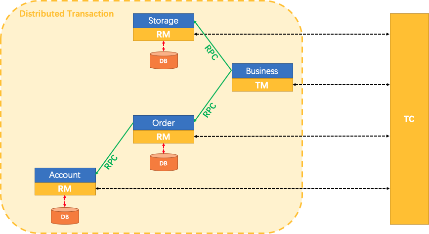

Seata: Simple Extensible Autonomous Transaction Architecture

首先，什么是分布式事务？一个分布式事务是一种全局的事务，它由一系列分支事务或者说本地事务组成。

Seata有3个基本的组件组成。

Transaction Coordinator(TC)：事务协调者，管理全局和分支事务的状态，用于全局性事务的提交和回滚。
Transaction Manager(TM)：事务管理器，用于开启全局事务、提交或者回滚全局事务，是全局事务的开启者。
Resource Manager(RM)：资源管理器，用于分支事务上的资源管理，向TC注册分支事务，上报分支事务的状态，接受TC的命令来提交或回滚分支事务。

一个典型的，由Seata管理的分布式事务生命周期如下：

1. TM事务管理器，告诉TC事务协调者开始一个新的全局事务。TC产生一个XID表示一个全局事务。
2. XID通过微服务调用链传播
3. RM资源管理器，注册本地事务作为一个分支事务（XID）注册到TC。
4. TM通知TC提交或者回滚XID表示的全局事务。
5. TC控制XID表示的全局事务下所有分支事务提交或回滚。

## 使用场景

用户购买商品，整个业务涉及3个微服务。库存服务、工单服务、账户服务。

创建一个数据库，配置3个数据源

用Seata来保证Dubbo微服务间的数据一致性。

## 参考

[seata github](https://github.com/seata/seata)

[quick start](http://seata.io/en-us/docs/user/quickstart.html)

