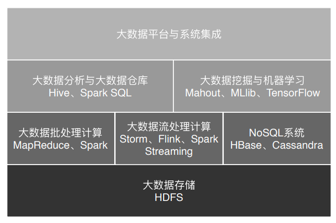

[TOC]

# Google 的架马车（2004）

|                                       | 相关产品  |
| ------------------------------------- | --------- |
| GFS（Google 文件系统） 分布式文件系统 | HDFS      |
| 大数据分布式计算框架 MapReduce        | MapReduce |
| NoSQL 数据库系统 BigTable             | Hbase     |

分布式

HBase是一个分布式、可扩展、列式存储的NoSQL数据库系统，构建在Apache Hadoop之上。它提供对大型数据集的实时读写访问，设计用于处理大量结构化和半结构化数据。HBase常用于需要对大量数据进行低延迟随机访问的应用程序。

# Hadoop（2006）

- 分布式文件系统 HDFS

- 分布式计算框架 MapReduce （执行引擎）
  
  - 主要使用磁盘作为存储介质
- HBase：基于 HDFS 的 NoSQL 系统。

  

# Hive（Facebook）

支持使用 SQL 语法来进行大数据计算。把 SQL 语句转化成 MapReduce 的计算程序。

Hive是基于Hadoop的一个数据仓库工具，用来进行数据提取、转化、加载，这是一种可以存储、查询和分析存储在Hadoop中的大规模数据的机制。Hive数据仓库工具能将结构化的数据文件映射为一张数据库表，并提供SQL查询功能，能将SQL语句转变成MapReduce任务来执行。 

# Yarn（2012）

资源调度系统

队列
任务：批式、流式

# Spark计算框架（2012）

与MapReduce平级

# 大数据业务场景

## 大数据批处理计算/大数据离线计算（天）

Spark sql

Flink

## 大数据流式计算/大数据实时计算

流计算框架

| Storm | Flink | Spark Streaming |
| ----- | ----- | --------------- |
|       | 分段  | 分段            |
|       |       |                 |

数据分析、统计

​	用 Hive、Spark SQL 等 SQL 引擎完成

数据挖掘、机器学习

​	机器学习框架 TensorFlow、Mahout 以及 MLlib 等

## 

## Scala

## Flink计算框架

流式计算

流执行环境 StreamExecutionEnvironment

数据流 DataStream

批处理计算

批处理执行环境 ExecutionEnvironment

数据集 DataSet

## ELK

elasticsearch

logstash

kibana

## Druid

