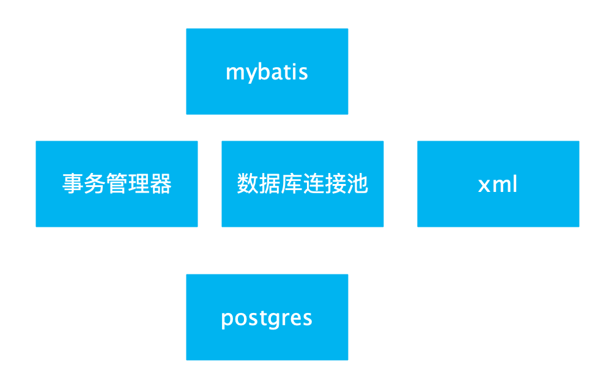

**ibatis**本是apache的一个开源项目，2010年这个项目由apache software foundation 迁移到了google code，并且改名为**mybatis**。

而 MyBatis 虽然仍然提供了一些映射的功能，但更加**以 SQL 为中心**，开发者可以侧重于 SQL 和存储过程，非常简单、直接。如果我们的应用需要大量**高性能的或者复杂的 SELECT 语句**等，“半自动”的 MyBatis 就会比 Hibernate 更加实用。

mybatis架构分为哪几层

- 基础支撑层：连接管理、事务管理、配置加载、缓存管理等最基础组件，为上层提供最基础的支撑。
- 数据处理层：参数映射、sql解析、sql执行、结果映射等处理，可以理解为请求到达，完成一次数据库操作的流程。
- API接口层：对外提供API，提供诸如数据的增删改查、获取配置等接口。

阅读源码关注点

- SQL怎么解析生成
- SQL执行到结果映射的处理过程
- 映射的细节、原理
- Mybatis日志框架

## ORM框架

MyBatis 是一个 ORM（Object Relational Mapping，对象 - 关系映射）框架。

ORM 框架主要是根据类和数据库表之间的映射关系，帮助程序员自动实现对象与数据库中数据之间的互相转化。说得更具体点就是，ORM 负责将程序中的对象存储到数据库中、将数据库中的数据转化为程序中的对象。（对象  <-->数据库中的数据）

## 对比

| 框架                   | 优缺点                                             |                     |
| ---------------------- | -------------------------------------------------- | ------------------- |
| 原生JDBC               |                                                    |                     |
| JdbcTemplate（Spring） | 功能最简单，易用性最差，性能损耗最少               |                     |
| MyBatis                | 在易用性、性能、灵活性三个方面做到了权衡           | 半自动化的 ORM 框架 |
| Hibernate              | 功能最完善，易用性最好，但相对来说性能损耗就最高了 | 全自动化的 ORM 框架 |

MyBbatis使用了**JDK动态代理**机制，动态为**接口**生成了代理类。

org.apache.ibatis.binding：Mybatis关于包装Mapper的代码

MapperRegistry ：注册Mapper接口、获取代理类实例

SqlSession .getMapper

Configuration .<T>getMapper

MapperRegistry .getMapper //获取生成的代理对象

MapperProxyFactory：创建Mapper代理对象的工厂

MapperProxy实现了JDK的动态代理接口 InvocationHandler

在原生jdbc中，我们要执行一个sql语句，它的流程是这样的：

1. 注册驱动；

2. 获取jdbc连接；

3. 创建参数化预编译SQL；

4. 绑定参数；

5. 发送SQL给数据库进行执行；

6. 对于查询，获取结果集到应用；

同样的，在mybatis中，要执行sql语句，首先要拿到代表JDBC底层连接的一个对象，这在mybatis中的实现就是SqlSession。

XML 头部的声明，它用来验证 XML 文档的正确性

## Mybatis启动过程

# 参考

[官方中文文档](https://mybatis.org/mybatis-3/zh/getting-started.html)

[Mybatis中Mapper动态代理的实现原理](https://blog.csdn.net/xiaokang123456kao/java/article/details/76228684)

[Mybatis入门.md](http://note.youdao.com/noteshare?id=a33f3b495b2c74fb5b60c69b2f379844&sub=C3AE0CC1B2AB462DAA40DD43A2392B91)

[Mybatis3源码分析(16)-Sql解析执行-结果集映射(ResultSetHandler)](https://blog.csdn.net/ashan_li/article/details/50379458)

[mybatis 3.x源码深度解析与最佳实践](https://www.cnblogs.com/zhjh256/p/8512392.html#4.2.1-获取opensession)

[《深入理解mybatis原理》 MyBatis的架构设计以及实例分析](https://blog.csdn.net/luanlouis/article/details/40422941)

[debug源码之mybatis](https://blog.csdn.net/a412451848/article/details/82723754)

[了解Mybatis的工作原理吗？](https://mp.weixin.qq.com/s/ursxCIUIFkVpnxu4qJanfQ)

