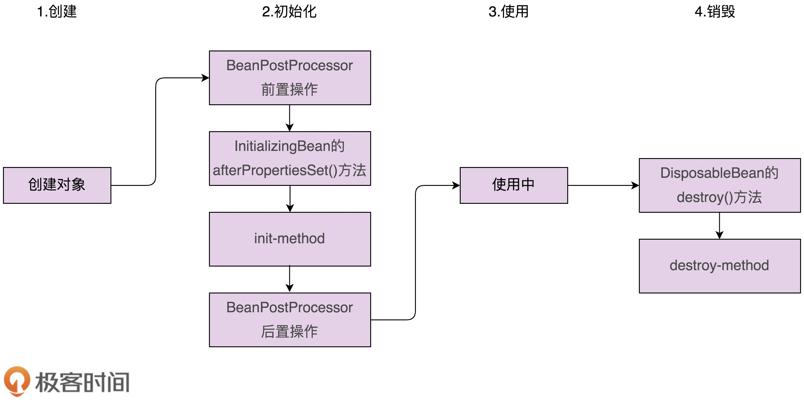

[TOC]

我们常说的 Spring 框架，是指 Spring Framework 基础框架。Spring Framework 是整个 Spring 生态（也被称作 Spring 全家桶）的基石。除了 Spring Framework，Spring 全家桶中还有更多基于 Spring Framework 开发出来的、整合更多功能的框架，比如 Spring Boot、Spring Cloud。

Spring MVC：

它是支持 Web 开发的 MVC 框架，提供了 URL 路由、Session 管理、模板引擎等跟 Web 开发相关的一系列功能。

Spring Boot 是基于 Spring Framework 开发的。它更加专注于微服务开发。

Spring Cloud 主要负责微服务集群的服务治理工作

**1.IoC容器**

**2.资源Resources**  实现了Java IO

**3.校验、数据绑定、类型转换**

**4.Spring表达式语言**

**5.Spring中的面向切面编程**

**6.Spring AOP APIs**

**7.数据缓存、数据编解码器**

**8.附录**

## Spring的设计思想或原则

- 约定大于配置（XML配置）
  - 基于注解
  - 基于约定
    - 在 Spring JPA（基于 ORM 框架、JPA 规范的基础上，封装的一套 JPA 应用框架）中，我们约定类名默认跟表名相同，属性名默认跟表字段名相同，String 类型对应数据库中的 varchar 类型，long 类型对应数据库中的 bigint 类型等等。

- 低侵入松耦合

  框架代码很少耦合在业务代码中。低侵入意味着，当我们要替换一个框架的时候，对原有的业务代码改动会很少。

- 模块化轻量级

- 再封装、再抽象	

  - spring-data-redis 模块，对 Redis Java 开发类库（比如 Jedis、Lettuce）做了进一步的封装
  - Spring Cache，定义了统一、抽象的 Cache 访问接口，这些接口不依赖具体的 Cache 实现（Redis、Guava Cache、Caffeine 等）。

## 设计模式

### 观察者模式

Event 事件（相当于消息）：定义ApplicationEvent接口

Listener 监听者（相当于观察者）：定义ApplicationListener接口

Publisher 发送者（相当于被观察者）：调用 ApplicationContext 来发送事件消息。

ApplicationEvent、ApplicationListener最大的作用是做类型标识之用。

Spring中观察者注册到了 ApplicationContext 对象（AbstractApplicationContext）中。ApplicationContext 这个类并不只是为观察者模式服务的。它底层依赖 BeanFactory（IOC 的主要实现类），提供应用启动、运行时的**上下文**信息，是访问这些信息的最顶层接口。

### 模版模式（实现方式类似于Callback 回调）

#### Spring Bean 的创建过程

##### 对象的创建

对象的创建是通过反射来动态生成对象，而不是 new 方法。不管是哪种方式，说白了，总归还是调用构造函数来生成对象。

##### 对象的初始化

初始化前置操作、初始化、初始化后置操作

两种初始化方式

1. xml配置文件中通过init-method 属性来指定初始化函数。Spring 通过反射，在运行时动态地调用这个初始化函数。而反射又会影响代码执行的性能。
2. 类实现 Initializingbean 接口。这个接口包含一个固定的初始化函数定义（afterPropertiesSet() 函数）。Spring 在初始化 Bean 的时候，可以直接通过 bean.afterPropertiesSet() 的方式，调用 Bean 对象上的这个函数，而不需要使用反射来调用了。业务代码（DemoClass）跟框架代码（InitializingBean）耦合在了一起。

初始化前置后置操作的实现

1. BeanPostProcessor

##### Bean 的销毁过程

1. 通过配置 destroy-method 指定类中的销毁函数
2. 类实现 DisposableBean 接口

### 适配器模式：统一多个类的接口设计

定义Controller的方式

通过 @Controller 注解来标记某个类是 Controller 类，通过 @RequesMapping 注解来标记函数对应的 URL。

实现 Controller 接口

实现 Servlet 接口

在应用启动的时候，Spring 容器会加载这些 Controller 类，并且解析出 URL 对应的处理函数，封装成 Handler 对象，存储到 HandlerMapping 对象中。当有请求到来的时候，DispatcherServlet 从 HanderMapping 中，查找请求 URL 对应的 Handler，然后调用执行 Handler 对应的函数代码，最后将执行结果返回给客户端。

DispatcherServlet 需要根据不同类型的 Controller，调用不同的函数。

Spring 定义了统一的接口 HandlerAdapter，并且对每种 Controller 定义了对应的适配器类。这些适配器类包括：AnnotationMethodHandlerAdapter、SimpleControllerHandlerAdapter、SimpleServletHandlerAdapter 等。统一调用 HandlerAdapter 的 handle() 函数

