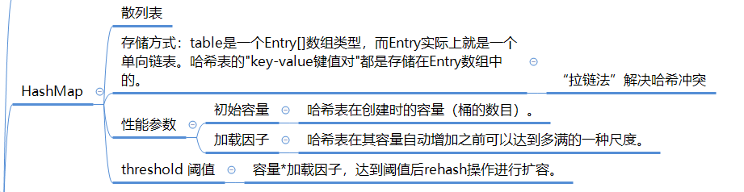

[TOC]


## Hashtable、HashMap、TreeMap的区别

### HashTable

- 不支持null键、值

```java
    public synchronized V put(K key, V value) {
        // Make sure the value is not null
        if (value == null) {
            throw new NullPointerException();
        }

        // Makes sure the key is not already in the hashtable.
        Entry<?,?> tab[] = table;
        int hash = key.hashCode(); // key不能为null，否则这里抛出空指针
        int index = (hash & 0x7FFFFFFF) % tab.length;
        @SuppressWarnings("unchecked")
        Entry<K,V> entry = (Entry<K,V>)tab[index];
        for(; entry != null ; entry = entry.next) {
            if ((entry.hash == hash) && entry.key.equals(key)) {
                V old = entry.value;
                entry.value = value;
                return old;
            }
        }

        addEntry(hash, key, value, index);
        return null;
    }
```

- 方法都加了synchronized


### HashMap

- java 7（Entry） 

- java 8（Node/TreeNode） 数组/链表/红黑树

​	HashMap内部数据是以散列表的方式进行存储的。散列表table是一个实现了Entry接口的Node数组。每一个Node（Entry）存储了key，key的hash值和value值。以及一个Node单向链表。

​	当往HashMap中添加元素时，首先计算key的hash值。key为null时，hash值为0，key非空时，调用key的hashcode方法计算得到h，然后h无符号（>>>）右移16位，与其自身异或，得到最终的hash值。

​	如果table为null或长度为0，则resize（）扩容；

​		创建新的大数组，迁移数据

​	计算下标 (n - 1) & hash （取hash值的低几位），如果下表下没有链表，则newNode（）


判断重复的key




- 非同步
- 支持null键、值

```java
public class HashMap<K,V> extends AbstractMap<K,V>
    implements Map<K,V>, Cloneable, Serializable {
  
    transient int size; //键值对数目
  
    public V put(K key, V value) {
        return putVal(hash(key), key, value, false, true);
    }

    static final int hash(Object key) {
        int h;
        return (key == null) ? 0 : (h = key.hashCode()) ^ (h >>> 16); //key可以为null
    }
 
// 第四个参数 onlyIfAbsent 如果是 true，那么只有在不存在该 key 时才会进行 put 操作。key存在时，返回oldValue。
// 第五个参数 evict 我们这里不关心  
  final V putVal(int hash, K key, V value, boolean onlyIfAbsent,
                   boolean evict) {
        Node<K,V>[] tab;  // 指向table的引用
        Node<K,V> p; 
        int n,  ；// tab的长度
        i;
        if ((tab = table) == null || (n = tab.length) == 0)
            n = (tab = resize()).length; // 第一次执行
     // 找到具体的数组下标，如果此位置没有值，那么直接初始化一下 Node 并放置在这个位置就可以了
        if ((p = tab[i = (n - 1) & hash]) == null)
            tab[i] = newNode(hash, key, value, null);
        else { // 数组该位置有数据
            Node<K,V> e; K k;
          // 首先，判断该位置的第一个数据和我们要插入的数据，key 是不是"相等"，如果是，取出这个节点
            if (p.hash == hash &&
                ((k = p.key) == key || (key != null && key.equals(k))))
                e = p;
            else if (p instanceof TreeNode) // 红黑树
                e = ((TreeNode<K,V>)p).putTreeVal(this, tab, hash, key, value);
            else {
              // 到这里，说明数组该位置上是一个链表
                for (int binCount = 0; ; ++binCount) {
                    if ((e = p.next) == null) {
                      // TREEIFY_THRESHOLD 为 8，所以，如果新插入的值是链表中的第 8 个
                    // 会触发下面的 treeifyBin，也就是将链表转换为红黑树
                        p.next = newNode(hash, key, value, null);
                        if (binCount >= TREEIFY_THRESHOLD - 1) // -1 for 1st
                            treeifyBin(tab, hash);
                        break;
                    }
                  // 如果在该链表中找到了"相等"的 key(== 或 equals)
                    if (e.hash == hash &&
                        ((k = e.key) == key || (key != null && key.equals(k))))
                      // 此时 break，那么 e 为链表中[与要插入的新值的 key "相等"]的 node
                        break;
                    p = e;
                }
            }
        // e!=null 说明存在旧值的key与要插入的key"相等"
        // 对于我们分析的put操作，下面这个 if 其实就是进行 "值覆盖"，然后返回旧值
            if (e != null) { // existing mapping for key
                V oldValue = e.value;
                if (!onlyIfAbsent || oldValue == null)
                    e.value = value;
                afterNodeAccess(e);
                return oldValue;
            }
        }
        ++modCount;
    // 如果 HashMap 由于新插入这个值导致 size 已经超过了阈值，需要进行扩容
        if (++size > threshold)
            resize();
        afterNodeInsertion(evict);
        return null;
    }  
  
}
```

- put、get常数时间性能
- 内部实现基本点
- - 数组（桶、哈希值寻址）、链表、链表的阈值
  - lazy-load原则、put方法中初始化
  - resize：初始化、扩容
- 容量：始终保持2的幂数、默认初始化容量16。可以扩容，扩容后数组大小为当前的 2 倍。
- 负载因子：默认为0.75f
- 扩容阈值：容量 * 负载因子
- 树化改造

```java
public class HashMap<K,V> extends AbstractMap<K,V>
    implements Map<K,V>, Cloneable, Serializable {

    private static final long serialVersionUID = 362498820763181265L;

    static final int DEFAULT_INITIAL_CAPACITY = 1 << 4; // aka 16

    static final int MAXIMUM_CAPACITY = 1 << 30;

    static final float DEFAULT_LOAD_FACTOR = 0.75f; // loadFactor的默认值

    static final int TREEIFY_THRESHOLD = 8; // 树化阈值，插入链表第8个元素时，会进行树化。

    static final int UNTREEIFY_THRESHOLD = 6;

    static final int MIN_TREEIFY_CAPACITY = 64;
  
    //HashMap是一个数组，数组中每个元素是一个单向链表。
    //单向链表中每个节点是，嵌套类 Entry 的实例。
    //Entry 包含四个属性：key, value, hash 值和用于单向链表的 next。
    transient Node<K,V>[] table;
  
    static class Node<K,V> implements Map.Entry<K,V> {
        final int hash;
        final K key;
        V value;
        Node<K,V> next;
    }
  
    int threshold; // 扩容的阈值，等于 capacity * loadFactor
  
    final float loadFactor; //负载因子
}
```

##### 

### LinkedHashMap(有序)

- 遍历顺序符合插入顺序

  

### TreeMap

- 红黑树
- 顺序访问
- 指定Comparator、Comparable（自然顺序）


## hashCode和equals的基本约定

对象的散列码是为了更好的支持基于哈希机制的Java集合类，例如 Hashtable, HashMap, HashSet 等。

### 原始的hashCode

Object中，equals默认使用==比较两个对象的地址。只有this 和 obj引用同一个对象，才会返回true。

```java
public boolean equals(Object obj) {
	return (this == obj);
}
```

### 原始的equals

Object中，hashCode默认使用对象的地址计算散列码；

```java
public native int hashCode();
```

重写equals和hashCode

2. 重写equals()方法需要满足5个约定

   - 自反性：x.equals(x) 一定是true
   - 对null：x.equals(null) 一定是false
   - 对称性：x.equals(y) 和 y.equals(x)结果一致
   - 传递性：a 和 b equals , b 和 c equals，那么 a 和 c也一定equals。
   - 一致性：在某个运行时期间，2个对象的状态的改变不会不影响equals的决策结果，那么，在这个运行时期间，无论调用多少次equals，都返回相同的结果。

3. 重写hashCode方法的3个要求为

   - 在某个运行时期间，只要对象的（字段的）变化不会影响equals方法的决策结果，那么，在这个期间，无论调用多少次hashCode，都必须返回同一个散列码。

   - **通过equals调用返回true 的2个对象的hashCode一定一样。**（重写equals必需重写hashCode的原因之一）

   - 通过equasl返回false 的2个对象的散列码不需要不同，也就是他们的hashCode方法的返回值允许出现相同的情况。

   总结一句话：等价的(调用equals返回true)对象必须产生相同的散列码。不等价的对象，不要求产生的散列码不相同。
   
### 相关编程规范


## 哈希码的有效性


## 参考

[一次性搞清楚equals和hashCode](https://mp.weixin.qq.com/s/uQEdjCq-zP5C8Z5jwHyoag)