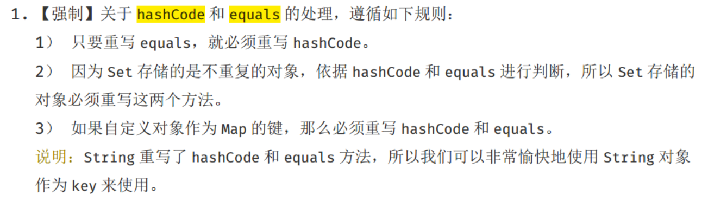

[TOC]


## Hashtable、HashMap、TreeMap的区别

### HashTable

- 不支持null键、值

```java
    public synchronized V put(K key, V value) {
        // Make sure the value is not null
        if (value == null) {
            throw new NullPointerException();
        }

        // Makes sure the key is not already in the hashtable.
        Entry<?,?> tab[] = table;
        int hash = key.hashCode(); // key不能为null，否则这里抛出空指针
        int index = (hash & 0x7FFFFFFF) % tab.length;
        @SuppressWarnings("unchecked")
        Entry<K,V> entry = (Entry<K,V>)tab[index];
        for(; entry != null ; entry = entry.next) {
            if ((entry.hash == hash) && entry.key.equals(key)) {
                V old = entry.value;
                entry.value = value;
                return old;
            }
        }

        addEntry(hash, key, value, index);
        return null;
    }
```

- 方法都加了synchronized


### HashMap


- 非同步
- 支持null键、值

```java
public class HashMap<K,V> extends AbstractMap<K,V>
    implements Map<K,V>, Cloneable, Serializable {
  
    public V put(K key, V value) {
        return putVal(hash(key), key, value, false, true);
    }

    static final int hash(Object key) {
        int h;
        return (key == null) ? 0 : (h = key.hashCode()) ^ (h >>> 16); //key可以为null
    }
  
}
```

- put、get常数时间性能
- 内部实现基本点
- - 数组（桶、哈希值寻址）、链表、链表的阈值
  - lazy-load原则、put方法中初始化
  - resize：初始化、扩容
- 容量：2的幂数、默认初始化容量16、最大容量。可以扩容，扩容后数组大小为当前的 2 倍。
- 负载因子：0.75f
- 树化改造

```java
public class HashMap<K,V> extends AbstractMap<K,V>
    implements Map<K,V>, Cloneable, Serializable {

    private static final long serialVersionUID = 362498820763181265L;

    static final int DEFAULT_INITIAL_CAPACITY = 1 << 4; // aka 16

    static final int MAXIMUM_CAPACITY = 1 << 30;

    static final float DEFAULT_LOAD_FACTOR = 0.75f; // loadFactor的默认值

    static final int TREEIFY_THRESHOLD = 8;

    static final int UNTREEIFY_THRESHOLD = 6;

    static final int MIN_TREEIFY_CAPACITY = 64;
  
    //HashMap是一个数组，数组中每个元素是一个单向链表。
    //单向链表中每个节点是，嵌套类 Entry 的实例。
    //Entry 包含四个属性：key, value, hash 值和用于单向链表的 next。
    transient Node<K,V>[] table;
  
    static class Node<K,V> implements Map.Entry<K,V> {
        final int hash;
        final K key;
        V value;
        Node<K,V> next;
    }
  
    int threshold; // 扩容的阈值，等于 capacity * loadFactor
  
    final float loadFactor; //负载因子
}
```

#### Java7 HashMap

##### put 过程分析
key可以为空最终会将这个 entry 放到 table[0] 中
    - 数组初始化
    - 计算具体数组位置
    - 添加节点到链表中
    - 数组扩容

##### get 过程分析

#### Java8 HashMap

##### put 过程分析

数组扩容

##### get 过程分析

### LinkedHashMap(有序)

- 遍历顺序符合插入顺序

  

### TreeMap

- 红黑树
- 顺序访问
- 指定Comparator、Comparable（自然顺序）


## hashCode和equals的基本约定

对象的散列码是为了更好的支持基于哈希机制的Java集合类，例如 Hashtable, HashMap, HashSet 等。

### 原始的hashCode

Object中，equals默认使用==比较两个对象的地址。只有this 和 obj引用同一个对象，才会返回true。

```java
public boolean equals(Object obj) {
	return (this == obj);
}
```

### 原始的equals

Object中，hashCode默认使用对象的地址计算散列码；

```java
public native int hashCode();
```

重写equals和hashCode

2. 重写equals()方法需要满足5个约定

   - 自反性：x.equals(x) 一定是true
   - 对null：x.equals(null) 一定是false
   - 对称性：x.equals(y) 和 y.equals(x)结果一致
   - 传递性：a 和 b equals , b 和 c equals，那么 a 和 c也一定equals。
   - 一致性：在某个运行时期间，2个对象的状态的改变不会不影响equals的决策结果，那么，在这个运行时期间，无论调用多少次equals，都返回相同的结果。

3. 重写hashCode方法的3个要求为

   - 在某个运行时期间，只要对象的（字段的）变化不会影响equals方法的决策结果，那么，在这个期间，无论调用多少次hashCode，都必须返回同一个散列码。

   - **通过equals调用返回true 的2个对象的hashCode一定一样。**（重写equals必需重写hashCode的原因之一）

   - 通过equasl返回false 的2个对象的散列码不需要不同，也就是他们的hashCode方法的返回值允许出现相同的情况。

   总结一句话：等价的(调用equals返回true)对象必须产生相同的散列码。不等价的对象，不要求产生的散列码不相同。
   
### 相关编程规范




## 哈希码的有效性


## 参考

[一次性搞清楚equals和hashCode](https://mp.weixin.qq.com/s/uQEdjCq-zP5C8Z5jwHyoag)