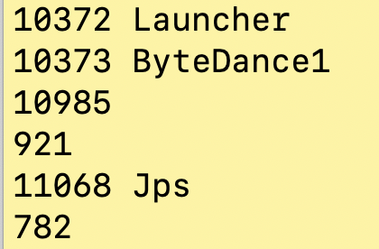
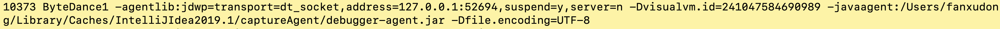
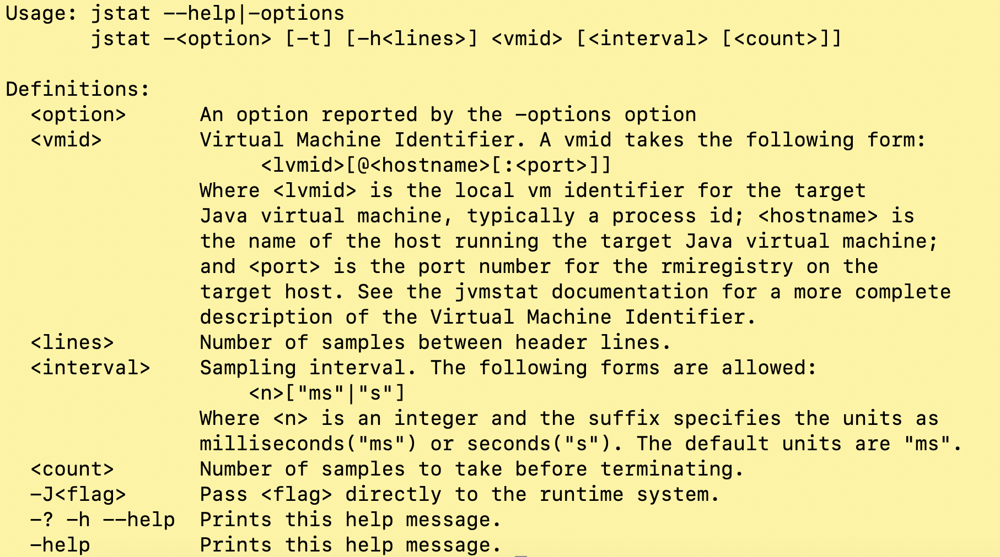
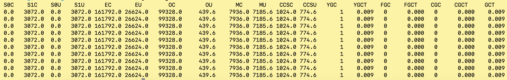
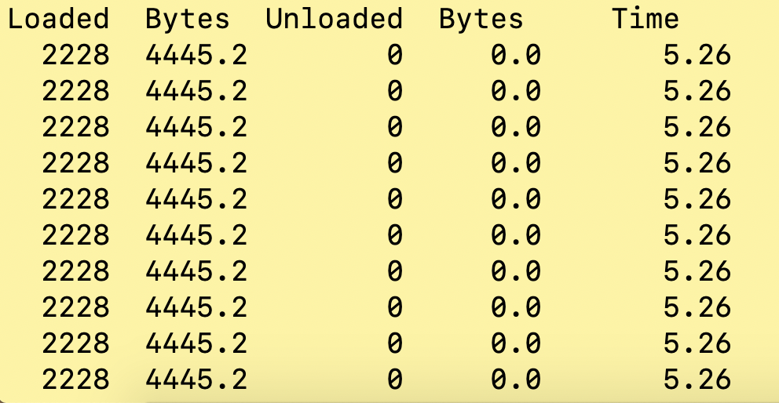
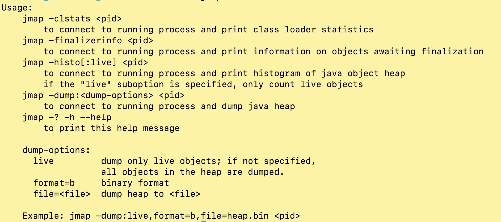

[TOC]

## jps

作用：查看Java进程ID

使用场景：

1. 该命令输出作为后续操作的输入，通常是前置操作
2. 可以用OS自动的命令替代，如ps

示例一：

```	shell
jps
```



示例二：输出jvm启动时配置的参数

```shell
jps -v
```



## jstat

作用：利用了JVM内建的指令对Java应用程序的资源和性能进行**实时的命令行监控**，包括对堆大小和垃圾回收状况（GC统计信息）的监控。

Usage：



 vmid：本地jvm进程的id，或远程jvm的主机名、端口号。

Interval：采样间隔

count：采样个数

示例一：监听java堆状况、包括Eden区、两个Survivor区、老年代、永久代等的容量，已用空间、GC时间合计信息等。

```shell
jstat -gc 10373 5000 10
```



```shell
jstat -gcutil 10373 5000 10
```


示例二：监视类装载、卸载数量、总空间及类装载所耗费的时间

```shell
jstat -class 10373 10000 10
```



## jinfo

作用：输出、修改运行时Java进程的环境变量和虚拟机参数。

## jmap

作用：查看java进程对内存的使用情况。常用于定位OutOfMemoryError或内存不足问题。



示例一：按照占用空间的大小打印程序中类的列表。live表示只计算存活的对象。

```shell
jmap -histo:live 10373
```

示例二：查看堆的概要信息。包括：堆的配置、堆的使用情况（新生代、老年代、Survivor区、Eden区、G1的region数等）

```shell
jhsdb jmap --heap --pid 10373
```

示例三：导出java堆的快照。后续可通过jhat或mat工具分析

```shell
jmap -dump:format=b,file=./head.hprof 10373
```


## jhat

作用：分析内存堆的快照文件。

## jstack

作用：打印线程堆栈快照信息。查看线程执行状态，分析线程等待、死锁等问题。

## HSDIS


## 参考

《深入理解Java虚拟机》第四章