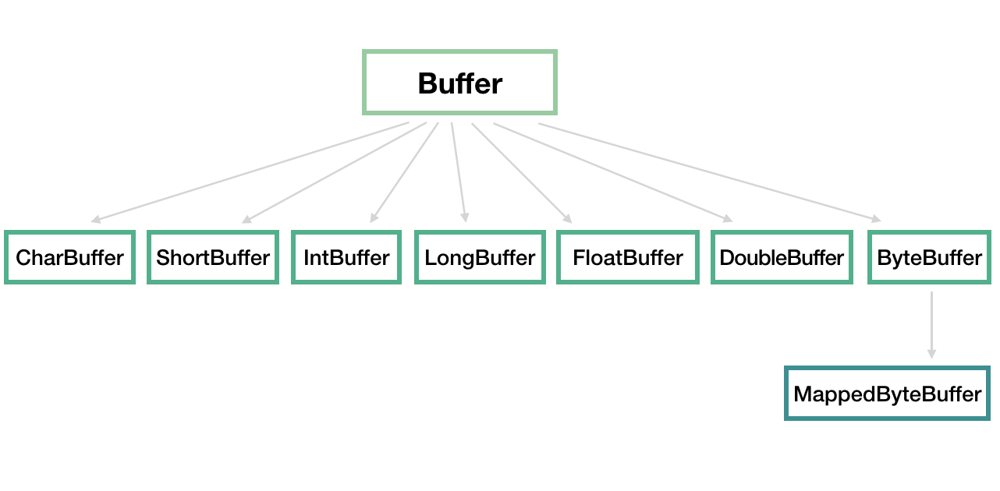

[TOC]

## Java IO 使用的场景

- 读取文件、输出文件（字节流、字符流、File）
- 网络数据传输（Socket）
- 序列化（对象序列化操作使用Serializable）

## File类

File类（文件类），它既能代表一个特定文件的名称，又能代表一个目录下的一组文件的名称。但是它不表示文件的内容。

File类常见方法：构造函数、判断文件是否存在、检查目录、创建目录、写入、读取

## 流（InputStream）

流代表任何有能力产出数据的<u>**数据源对象**</u>或者是有能力接收数据的<u>**接收端对象**</u>。实际的I/O设备，比如磁盘，网卡等，处理数据的方式各不相同。而流屏蔽了实际I/O设备中处理数据的细节。

**可能作为流的数据源有**

1. 字节数组（ByteArrayInputStream）
2. String对象
3. 文件（用File类表示）
4. 管道
5. 其他的流
6. 其他数据源，如Internet连接等

从流中读取数据FilterInputStream，向流写入数据FilterOutPutStream

### Java I/O类实现

### 类层次结构

|        | 字节流 (byte buf[]) | 字符流（char cb[]） |
| ------ | ------------------- | ------------------- |
| 输入流 | InputStream         | Reader              |
| 输出流 | OutputStream        | Writer              |

### 装饰器模式

叠合多个对象来提供所期望的功能。

## RandomAccessFile

### 用Java IO读取、写入一个文件？
同步：等待

异步：回调

阻塞：CPU等待

非阻塞：轮询

## NIO

多路复用的、同步非阻塞IO

NIO（Nonblocking I/O，非阻塞IO）：NIO的单线程能处理连接的数量比BIO要高出很多

### Channel

通道是数据来源或数据写入的目的地。（和流有什么区别？）

- FileChannel：文件通道，用于文件的读和写。不能配置为非阻塞，没有意义。
- DatagramChannel：用于 UDP 连接的接收和发送
- SocketChannel：把它理解为 TCP 连接通道，简单理解就是 TCP 客户端。可以配置为非阻塞。
- ServerSocketChannel：TCP 对应的服务端，用于监听某个端口进来的请求

### Selector
只能将非阻塞Channel注册到选择器上，否则就没有意义了。

### Buffer

一个 Buffer 本质上是内存中的一块，我们可以将数据写入这块内存，之后从这块内存获取数据。

ByteBuffer：核心

MappedByteBuffer 用于实现内存映射文件

position

limit

capacity

mark

写入模式

读出模式

## NIO 2 异步非阻塞，基于事件和回调机制

基础 API 功能与设计， InputStream/OutputStream 和 Reader/Writer 的关系和区别。

NIO、NIO 2 的基本组成。

给定场景，分别用不同模型实现，分析 BIO、NIO 等模式的设计和实现原理。

NIO 提供的高性能数据操作方式是基于什么原理，如何使用？

或者，从开发者的角度来看，你觉得 NIO 自身实现存在哪些问题？有什么改进的想法吗？

## 序列化

序列化后对象的大小

## 参考

[Java编程思想 （第4版）](https://book.douban.com/subject/2130190/)

[CyC Java IO](https://github.com/CyC2018/CS-Notes/blob/master/notes/Java%20IO.md)