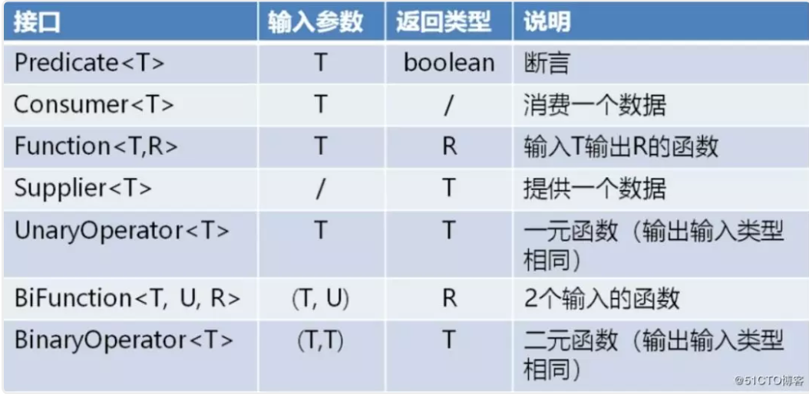

[TOC]


## 函数式编程

函数式编程是一种编程的思维方式，是种方法论。

告诉代码要做什么。

是基于某种语法或调用API去进行编程。 代码更简洁、易懂。

## 命令式编程

告诉代码要怎么做。需要自己去实现具体的逻辑细节。

## **lambda表达式**

lambda表达式是函数式编程的基础。使用lambda表达式一句代码就能完成线程的创建，lambda强调了函数的输入输出，隐藏了过程的细节，并且可以接受函数当作输入（参数）和输出（返回值）。lambda表达式可用于**创建**匿名方法，调用已存在的方法用方法引用。

## **@FunctionalInterface**注解

用于声明**函数接口**

1）接口只能有一个需要实现的方法，可使用lambda表达式获取该接口的实现实例

2）接口可定义默认方法

3）接口多重继承时，可指定使用哪一个接口的默认方法实现

示例：

```java
@FunctionalInterface
public interface Runnable {
    public abstract void run();
}
@FunctionalInterface
public interface Callable<V> {
    V call() throws Exception;
}

```


## JDK8自带的函数接口：



常用Function接口，它为我们省去定义一些不必要的函数接口，减少接口的数量。并支持链式操作（andThen）。

BiFunction接口就是比Function接口多了一个输入而已。（同理BiConsumer）

**方法引用**(Method Reference)。方法引用的标准形式是：类名::方法名。（注意：只需要写方法名，不需要写括号）。

4中方法引用的形式：


Java是强类型语言，不能在代码的任何地方可写Lambda表达式，使用Lambda表达式的依据是必须有相应的函数接口。Lambda的类型就是对应函数接口的类型。

Lambda表达式另一个依据是**类型推断**机制，在上下文信息足够的情况下，编译器可以推断出参数表的类型，而不需要显式指名。所以说 Lambda 表达式的类型是从 Lambda 的上下文推断出来的，上下文中 Lambda 表达式需要的类型称为**目标类型**，如下图所示：


级联表达式和柯里化

简单来说柯里化就是把本来多个参数的函数转换为只有一个参数的函数


## **lambda表达式的实现原理：**

https://www.cnblogs.com/WJ5888/p/4667086.html

https://blog.csdn.net/zxhoo/article/details/38495085

Java 8中，Lambda表达式首先会生成一个**私有静态函数**，这个私有的静态函数干的就是Lambda表达式里面的内容。然后，在生成的**内部类**中调用这个静态函数。

使用**javap -p Lambda.class**，查看字节码文件中的私有静态函数。

-p表示输出所有类及成员


有lambda表达式的地方，运行时会进入函数LambdaMetafactory::**metafactory**，为Lambda表达式生成了一个内部类。

(indy指令：编译器会在每个Lambda表达式出现的地方插入一条indy指令

指令的bootstrap方法指向LambdaMetafactory.metafactory(...)方法。

CallSite、buildCallSite、spinInnerClass)

```java
public static CallSite metafactory(MethodHandles.Lookup caller,
                                   String invokedName,
                                   MethodType invokedType,
                                   MethodType samMethodType,
                                   MethodHandle implMethod,
                                   MethodType instantiatedMethodType)
        throws LambdaConversionException {
    AbstractValidatingLambdaMetafactory mf;
    mf = new InnerClassLambdaMetafactory(caller, invokedType,
                                         invokedName, samMethodType,
                                         implMethod, instantiatedMethodType,
                                         false, EMPTY_CLASS_ARRAY, EMPTY_MT_ARRAY);
    mf.validateMetafactoryArgs();
    return mf.buildCallSite();
}

```


## 参考

https://blog.csdn.net/aitangyong/article/details/54137067

javadoc注释或文档

https://mp.weixin.qq.com/s/opzyyAdIGzXCC9Gw_AjtqQ