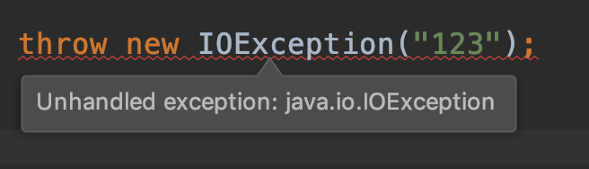

[TOC]

## Java异常继承体系

- unchecked exceptions （运行时异常）
  - 派生于Error的错误不用处理，因为通常代码无法处理。
  - RuntimeException异常不用处理。
  - 如果出现了RuntimeException，就一定是程序员自身的问题。

- checked exceptions
  - 所有其他的异常。
  - Checked Exception 的假设是我们捕获了异常，然后恢复程序。
  - 编译器将检查你是否为所有的checked exceptions提供了异常处理机制。
  - 比如IOException就必须做异常处理，否则编译无法通过。
   
  
  

## 从性能角度来审视 Java 的异常处理机制

- try-catch会影响 JVM 对代码进行优化。仅捕获有必要的代码段
- 不要用异常控制代码流程。
- Java 每实例化一个 Exception，都会对当时的栈进行快照。

## 常见异常总结

| 类名                               | 总结                                                         |
| ---------------------------------- | ------------------------------------------------------------ |
| InterruptedException               | Thrown when a thread is waiting, sleeping, or otherwise occupied, and the thread is interrupted, either before or during the activity.当线程被interrupted时抛出此异常。当我们看到方法上带有 throws InterruptedException 时，我们就要知道，这个方法应该是阻塞方法，我们如果希望它能早点返回的话，我们往往可以通过中断来实现。 https://docs.oracle.com/javase/10/docs/api/java/lang/InterruptedException.html |
| ExecutionException                 | Exception thrown when attempting to retrieve the result of a task that aborted by throwing an exception. This exception can be inspected using the Throwable.getCause() method.线程池中有任务执行失败时，抛出的异常 |
| TimeoutException                   |                                                              |
| NullPointerException               | 对null 调用成员访问符时，报空指针                            |
| FileNotFoundException              | extends IOException                                          |
| IllegalArgumentException           |                                                              |
| NoSuchMethodError                  | 《Spring》81：在类路径下放置了多个不同版本的类包。           |
| ClassNotFoundException             | 从本地系统载入Class文件时，找不到该Class文件。jar包找不到。  |
| IllegalAccessException             | 通过反射访问private或protected成员变量和方法时，未通过setAccessible设置为true |
| SecurityException：JVM             | 设置了相应的安全机制，但调用了setAccessible方法              |
| IOException                        |                                                              |
| ActivitiOptimisticLockingException | Exception that is thrown when an optimistic locking occurs in the datastore caused by concurrent access of the same data entry.https://www.activiti.org/javadocs/org/activiti/engine/activitioptimisticlockingexception |
| Throwable                          | * The {@code Throwable} class is the superclass of all **errors** and * **exceptions** in the Java language. Only objects that are instances of this * class (or one of its subclasses) are thrown by the Java Virtual Machine or* can be thrown by the Java {@code throw} statement. Similarly, only* this class or one of its subclasses can be the argument type in a* {@code catch} clause.* For the purposes of **compile-time checking of exceptions**, {@code * Throwable} and any subclass of {@code Throwable} that is not also a* subclass of either {@link RuntimeException} or {@link Error} are* regarded as **checked exceptions**.常用方法public synchronized Throwable getCause()   * Returns the cause of this throwable or {@code null} if the  * cause is nonexistent or unknown.  (The cause is the throwable that  * caused this throwable to get thrown.)public String getMessage() public void printStackTrace() |
| Exception                          | public class Exception extends Throwable * The class {**@code** Exception} and its subclasses are a form of * {**@code** Throwable} that indicates conditions that a reasonable * application might want to catch.** 
The class {**@code** Exception} and any subclasses that are not also * subclasses of {**@link** RuntimeException} are <em>**checked** *** exceptions**</em>. Checked exceptions need to be declared in a* method or constructor's {**@code** throws} clause if they can be thrown * by the execution of the method or constructor and propagate outside* the method or constructor boundary.1、Exception及其子类，表示一种应用需要catch的状态。2、 Exception及其子类，除了RuntimeException外为**checked** **exceptions** |
| ErrorOutOfMemoryError              | public class Error extends Throwable * An {@code Error} is a subclass of {@code Throwable}* that indicates serious problems that a reasonable application* should not try to catch. Most such errors are abnormal conditions.* The {@code ThreadDeath} error, though a "normal" condition,* is also a subclass of {@code Error} because most applications* should not try to catch it.* 
* A method is not required to declare in its {@code throws}* clause any subclasses of {@code Error} that might be thrown* during the execution of the method but not caught, since these* errors are abnormal conditions that should never occur.** That is, {@code Error} and its subclasses are regarded as **unchecked** *** exceptions** for the purposes of compile-time checking of exceptions.1、Throwable的子类。2、Error表示严重的问题（编译和系统错误，内存溢出或没有可用内存），这种问题程序无法解决，并且不能catch。3、Error为**unchecked** **exceptions** |
| RuntimeExpection                   | public class RuntimeException extends Exception * {**@code** RuntimeException} is the superclass of those * exceptions that can be thrown during the normal operation of the* Java Virtual Machine.** 
{**@code** RuntimeException} and its subclasses are <em>**unchecked** *** exceptions**</em>. Unchecked exceptions do <em>not</em> need to be* declared in a **method or constructor's {****@code** **throws} clause （方法或构造函数的throws子句）** if they * can be thrown by the execution of the method or constructor and* propagate outside the method or constructor boundary.1、RuntimeException和其子类为**unchecked** **exceptions，** |

## 问题

1. Exception和Error有什么区别？（NoClassDefFoundError 和 ClassNotFoundException 有什么区别？）
   1） 是否尝试恢复程序
   2） NoClassDefFoundError通常由maven未引入对应jar包导致，代码无法处理此异常。
   3） ClassNotFoundException通常由Class.forName方法来动态地加载类时，找不到类导致。

   

2. 运行时异常与一般异常的区别？

   1）运行时异常（RuntimeException）不用做异常处理，比如NullPointerException，通常是由代码bug导致，需要抛出。

   2）一般异常需要程序员在代码中捕获并处理，比如IOException。有时候也会捕获一般异常，并抛出RuntimeException。

   

## 参考

[详解Java中的checked异常和unchecked异常](https://blog.csdn.net/qq_14982047/article/details/50989761)

[第2讲 | Exception和Error有什么区别？](https://time.geekbang.org/column/article/6849)

