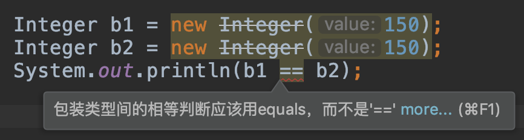
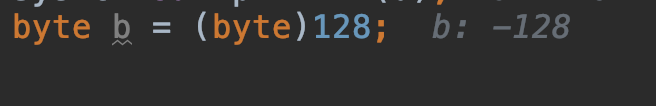

[TOC]


## 8大基本数据类型

| 基本数据类型 | 长度  | 示例                                                     | 包装类型  | 装箱、拆箱                          |
| ------------ | ----- | -------------------------------------------------------- | --------- | ----------------------------------- |
| byte         | 1字节 | 10000000（-128）～ 01111111（127）                       | Byte      |                                     |
| short        | 2字节 | 10000000 00000000（-32768）～ 01111111 11111111（32767） | Short     |                                     |
| int          | 4字节 | -2^31 （-2,147,483,648）到 2^31-1（2,147,483,647）       | Integer   | Integer.valueOf（） xx.intValue（） |
| long         | 8字节 |                                                          | Long      |                                     |
| char         | 2字节 | 0~65536、'a'、'中'                                       | Character |                                     |
| float        | 4字节 |                                                          | Float     |                                     |
| double       | 8字节 |                                                          | Double    |                                     |
| boolean      |       | true、false                                              | Boolean   |                                     |

## 自动装箱 / 自动拆箱是发生在什么阶段？ 

## 自动装箱的时候，缓存机制起作用吗？

## 为什么我们需要原始数据类型

## Integer与int的区别

1、Integer与int 比较时自动拆箱，所以结果为true
```java
new Integer(150) == 150
```

2、Integer默认缓存了数字-128～127，所以两个对象地址相同，返回true

```java
new Integer(100) == new Integer(100)
```

3、150超出缓存-128～127，所以两个对象地址不同，返回false

```java
new Integer(150) == new Integer(150)
```

4、


## 数据类型转换

### 向上转型

### 向下转型

1. 强制向下转型，数据丢失



## switch支持的类型

char、Character

byte、Byte

short、Short

int、Integer

enum

String

注：不支持long

