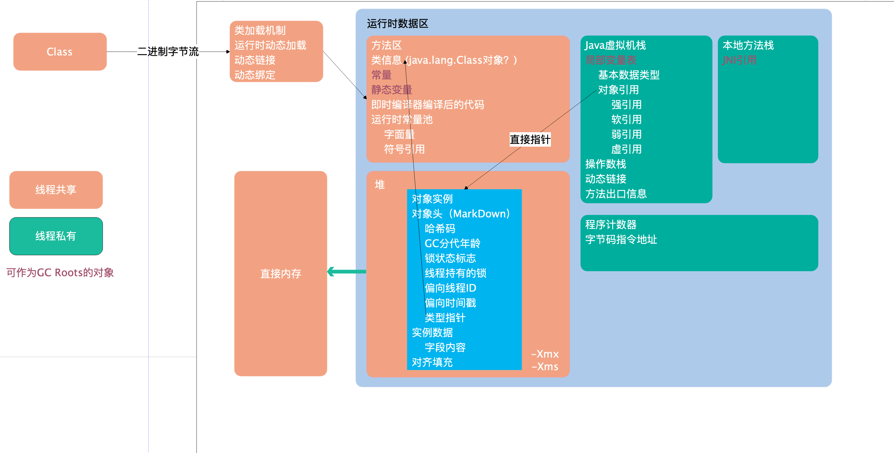

[TOC]

## Java 对象生命周期

## Mark Word

## 其他实践

java_pid3708.hprof：Sun, HP, SAP 所采用的 HPROF 二进制堆存储文件（Heap Dump）

- 发生内存泄露时抓拍下当时的内存状态

-XX:+HeapDumpOnOutOfMemoryError 

-XX:HeapDumpPath=${CATALINA_HOME}/logs JVM 

## 参考

https://blog.csdn.net/yanghongchang_/article/details/7711911

https://www.ibm.com/developerworks/cn/opensource/os-cn-ecl-ma/index.html?ca=drs-