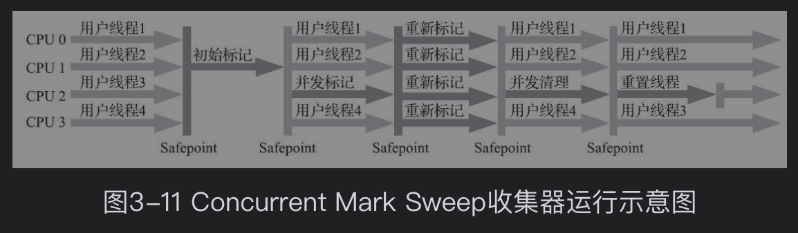
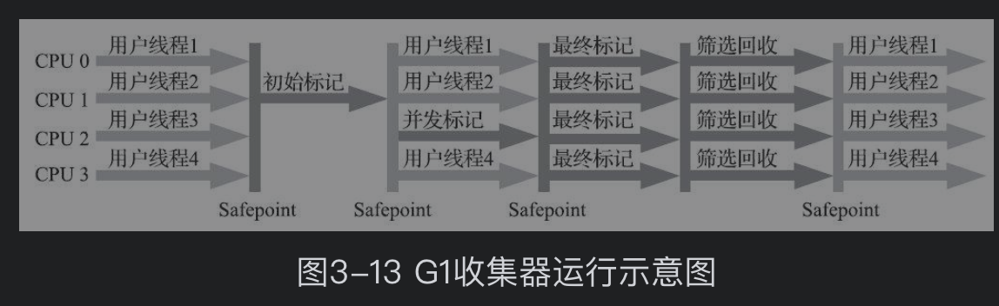

[TOC]

## 对象存活判定算法

### 引用计数算法

- 给对象添加一个引用计数器，引用对象时，计数器加1，引用失效时，计数器减1。
- 很难解决对象间循环引用的问题。

### 可达性分析算法

- 对象到GC Roots对象不可达，或则说没有引用链，则对象不可用。
- 4种GC Roots对象
    1. 方法区的类静态属性
    2. 方法区的常量引用的对象
    3. 虚拟机栈中引用的对象
    4. 本地方法栈中JNI引用的对象

### HotSpot算法实现

- 安全点
程序执行时，到达安全点时才能GC
当 JVM 进入安全点（SafePoint）的时候，会检查是否有闲置的 Monitor，然后试图进行降级。

- 安全区域
引用关系不会发生变化的代码区域

## 垃圾搜集算法     

### 标记-清除算法

- 标记出所有需要回收的对象，并统一回收
- 效率低，产生大量内存碎片

### 复制算法

- 用于新生代的回收。将新生代分为一块Eden和两块Survivor，比例为8:1:1
- Survivor空间不够时，需要老年代进行分配担保

### 标记-整理算法

- 标记出所有需要回收的对象，将所有对象向一端移动，回收边界以外的内存

### 分代收集算法

- 新生代使用复制算法
- 老年代使用 标记-清理 或 标记-整理 算法

## 垃圾收集器

### CMS收集器

1. 初始标记 stop the word
2. 并发标记 concurrent mark
3. 重新标记 stop the word
4. 并发清理 concurrent sweep

### G1收集器（Region + 优先级 -> 高效）

JDK 9 中G1为默认垃圾收集器。

G1收集器的设计思路是面向局部收集，通过基于Region的内存布局形式来实现。

G1是能够建立起可预测的“停顿时间模型”的收集器：指定在一个长度为M毫秒的时间片段内，消耗在垃圾收集上的时间大概率不超过N毫秒这样的目标。

G1可以面向堆内存任何部分来组成回收集（Collection Set，一般简称CSet）进行回收。

G1不再坚持固定大小以及固定数量的分代区域划分，而是把连续的Java堆划分为多个大小相等的独立区域（Region），每一个Region都可以根据需要，扮演新生代的Eden空间、Survivor空间，或者老年代空间。收集器能够对扮演不同角色的Region采用不同的策略去处理，这样无论是新创建的对象还是已经存活了一段时间、熬过多次收集的旧对象都能获取很好的收集效果。

Humongous区域，专门用来存储大对象。

Region作为单次回收的最小单元，这样可以有计划地避免在整个Java堆中进行全区域的垃圾收集。

让G1收集器去跟踪各个Region里面的垃圾堆积的“价值”大小，价值即回收所获得的空间大小以及回收所需时间的经验值，然后在后台维护一个优先级列表，每次根据用户设定允许的收集停顿时间（使用参数-XX：MaxGCPauseMillis指定，默认值是200毫秒），优先处理回收价值收益最大的那些Region，这也就是“Garbage First”名字的由来。

1. 初始标记：仅仅只是标记一下**GC Roots能直接关联到的对象**，并且修改**TAMS**指针的值，让下一阶段用户线程并发运行时，能正确地在可用的Region中分配新对象。这个阶段需要停顿线程，但耗时很短，而且是借用进行Minor GC的时候同步完成的，所以G1收集器在这个阶段实际并没有额外的停顿。
2. 并发标记：从GC Root开始对堆中对象进行**可达性分析**，递归扫描整个堆里的对象图，找出要回收的对象，这阶段耗时较长，但可与用户程序并发执行。当对象图扫描完成以后，还要重新处理**SATB**记录下的在并发时有引用变动的对象。
3. 最终标记：对用户线程做另一个短暂的暂停，用于处理并发阶段结束后仍遗留下来的最后那少量的SATB记录。
4. 筛选回收：负责更新Region的统计数据，对各个Region的**回收价值和成本进行排序**，根据用户所期望的**停顿时间**来制定回收计划，可以自由选择任意多个Region构成回收集，然后把决定回收的那一部分Region的存活对象复制到空的Region中，再清理掉整个旧Region的全部空间。这里的操作涉及存活对象的移动，是必须暂停用户线程，由多条收集器线程并行完成的。

## GC调优

GC tuning is the last task to be done.

调优的目的：内存占用、延时（停顿导致延迟上升）、吞吐量（GC线程占用一部分CPU资源）

1. 将进入老年代的对象数量降到最低
2. 减少Full GC的执行时间

1. 先优化应用程序以减少GC负担，再启动GC参数优化。
2. 使用 StringBuilder或 StringBuffer来代替 String
3. 尽量少输出日志（什么日志？）
XML和JSON解析过程往往占用了最多的内存，用于解析XML或JSON文件的临时内存（大约10-100MB）。

## OOM问题定位

OOM是由于java内存溢出，或则内存太小，无法分配对象，导致的一种异常。

为了方便定位OOM问题，我们要在JVM的启动参数中配置 -Xloggc:xxx/gc.log 来打印GC日志。配置-XX:+HeapDumpOnOutOfMemoryError，以便在出现OOM的时候将堆内存dump下来。

得到的GC日志可以通过gceasy.io或其他工具进行分析，观察GC的趋势。

堆内存dump文件可以通过eclipse 的 MAT工具进行读取。用来查看对象数量以及占用大小的直方图。以及对发生OOM时的线程快照进行分析。有时候工具给出的可疑的问题，就是发生内存泄漏的原因。

## 参考

[jvm系列(九):如何优化Java GC](https://mp.weixin.qq.com/s/ydkEkh_Uc1paftJLKIsm0w)

