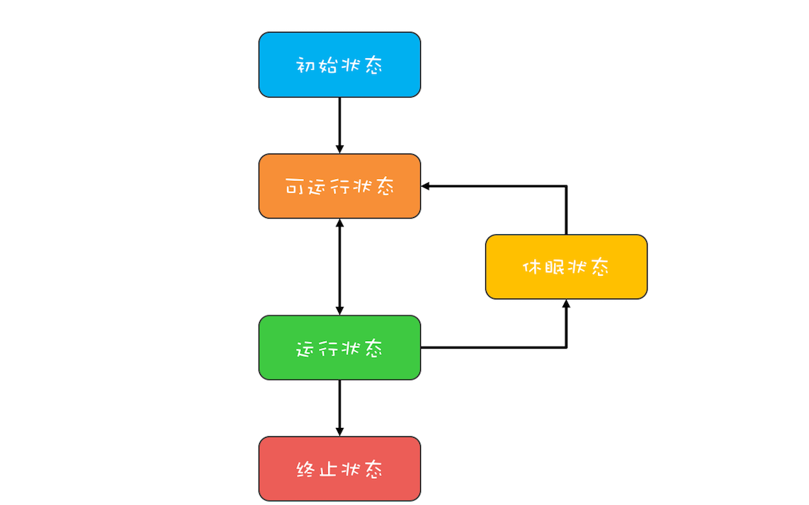

[TOC]

## 通用的线程生命周期（五态）




1. 初始状态
2. 可运行状态：等待CPU使用权
3. 运行状态：获得CPU使用权
4. 休眠状态
5. 终止状态


## Java 中线程的生命周期（六态）

1. NEW（初始化状态）
2. RUNNABLE（可运行 / 运行状态）：对五态模型进行合并。
3. BLOCKED（阻塞状态）：线程在等待 Monitor lock。3，4，5对五态模型中的***休眠状态***进行了细化。这3种状态没有CPU使用权。
4. WAITING（无时限等待）
5. TIMED_WAITING（有时限等待）
6. TERMINATED（终止状态）


可在Thread类中查看Java线程的6种状态
```java
 public class Thread implements Runnable {
   public enum State {
          NEW,
          RUNNABLE,
          BLOCKED,
          WAITING,
          TIMED_WAITING,
          TERMINATED;
    }
   
   //以 JNI 形式调用的本地代码。
    private native void start0();
		private native void setPriority0(int newPriority);
  	private native void interrupt0();   
 }
```


### 线程状态转换

- 线程创建
  1. extends Thread类，重写run方法
  2. implements Runnable接口，并作为Thread构造函数参数传入，重写run方法。（推荐。Runnable 的好处是，不会受 Java 不支持类多继承的限制，重用代码实现，当我们需要重复执行相应逻辑时优点明显。而且，也能更好的与现代 Java 并发库中的 Executor 之类框架结合使用。）


- 从 NEW 到 RUNNABLE 状态
  1. start()。多次调用start()，抛出java.lang.IllegalThreadStateException异常。


- RUNNABLE 与 BLOCKED 的状态转换
  
  1. 只有一种场景会触发这种转换，就是线程等待 synchronized 的隐式锁。
  
  
  
- RUNNABLE 与 WAITING 的状态转换
  1. 获得 synchronized 隐式锁的线程，调用无参数的 Object.wait() 方法。**（锁是否释放？）**
  2. 调用无参数的 Thread.join() 方法。
  3. 调用 LockSupport.park()、LockSupport.unpark(Thread thread) 方法。
  
  
  
- RUNNABLE 与 TIMED_WAITING 的状态转换
  1. 调用带超时参数的 Thread.sleep(long millis) 方法；**（锁是否释放？）**
  2. 获得 synchronized 隐式锁的线程，调用带超时参数的 Object.wait(long timeout) 方法；
  3. 调用带超时参数的 Thread.join(long millis) 方法；
  4. 调用带超时参数的 LockSupport.parkNanos(Object blocker, long deadline) 方法；
  5. 调用带超时参数的 LockSupport.parkUntil(long deadline) 方法。
  
  
  
- 从 RUNNABLE 到 TERMINATED 状态

  1. 线程正常或异常执行结束
  2. 调用stop()方法直接杀死线程，线程不会释放锁。（@Deprecated）
  3. 调用线程的interrupt()方法，通知线程中断。线程抛出InterruptedException异常，或者通过调用isInterrupted()方法检测通知。


## 执行new Thread，代码做了什么？

1. 调用操作系统内核的 API
2. 资源分配

## 线程状态分析工具

### jstack

### Java VisualVM


## 参考

[09 | Java线程（上）：Java线程的生命周期](https://time.geekbang.org/column/article/86366)

[第17讲 | 一个线程两次调用start()方法会出现什么情况？](https://time.geekbang.org/column/article/9103)

[Java线程的6种状态及切换(透彻讲解)](https://blog.csdn.net/pange1991/article/details/53860651/)

[线程的五大状态](https://blog.csdn.net/peter_teng/article/details/10197785)

