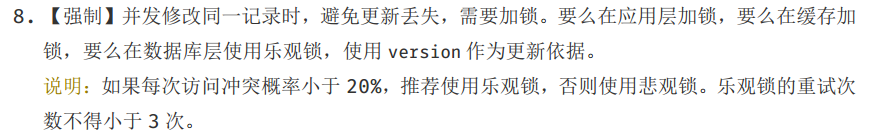

[TOC]

## 锁宏观上分类

### 乐观锁

乐观锁（ Optimistic Locking）是一种思想。相对悲观锁而言，乐观锁假设认为数据一般情况下不会造成冲突，所以在数据进行提交更新的时候，才会正式对数据的冲突与否进行检测，如果发现冲突了，则让返回用户错误的信息，让用户决定如何去做。假设多用户并发的事务在处理时不会彼此互相影响，各事务能够在不产生锁的情况下处理各自影响的那部分数据。在提交数据更新之前，每个事务会先检查在该事务读取数据后，有没有其他事务又修改了该数据。如果其他事务有更新的话，正在提交的事务会进行回滚。

#### 乐观锁的具体实现细节

主要就是两个步骤：冲突检测和数据更新。 如果没有冲突就更新数据。

其实现方式比较典型的就是Compare and Swap(CAS)。

version

Select for update

#### CAS

#### ABA问题

### 悲观锁
悲观并发控制主要用于数据争用激烈的环境，以及发生并发冲突时使用锁保护数据的成本要低于回滚事务的成本的环境中。

| 乐观锁   | 悲观锁   |
| -------- | -------- |
| 偏斜锁   | 重量级锁 |
| 轻量级锁 |          |
| 自旋锁   |          |

## 偏斜锁

## 自旋锁

线程不进入阻塞状态，减少用户态与内核态的切换。

等待时间

## 轻量级锁

## 重量级锁

锁膨胀、降级

## 死锁

死锁是一组互相竞争资源的线程因互相等待，导致“永久”阻塞的现象。
在多线程场景中，两个或多个线程之间，由于互相持有对方需要的锁，导致线程永久处于阻塞状态的现象叫死锁。

死锁需要满足四个必要条件才会产生，缺一不可。
1. 互斥：线程间互相等待的共享资源是互斥的，只能被一个线程占用。 
   1. 此为不可破坏的条件，加锁就是为了互斥
2. 占有且等待：线程已经取得一个共享资源 ，在等待另一个共享资源  的时候，不释放已获取的共享资源 ；
   1. 一次申请所有资源，要么全部申请到，要么一个也申请不到。就不会出现等待的情况：
3. 不可抢占：其他线程不能强行抢占线程所占有的资源；
   1. 使用java.util.concurrent.Lock的实现ReentrantLock ，支持非阻塞式的获取锁操作 tryLock()。 
   2. 使用带超时的方法，Object.wait(…) 或者 CountDownLatch.await(…)
4. 循环等待：两个线程互相等待对方占有的资源，就是循环等待。
   1. 按顺序申请资源

如何避免死锁？日常编程中，当线程需要申请多个共享资源时，按指定循序一次申请所有资源，有一个资源申请失败则释放已申请到的资源。（银行家算法？）

当死锁出现时，首先，可以使用 jps 或者系统的 ps 命令、任务管理器等工具，确定Java进程 ID。然后，调用 jstack 获取指定线程的线程栈。然后，找到线程状态为blocked的线程，查看它们waiting to lock和locked的资源是否为互相等待来确定死锁。

如果程序运行时发生了死锁，绝大多数情况下都是无法在线解决的，只能重启、修正程序本身问题。

其他问题：
- 抛开字面上的概念，让面试者写一个可能死锁的程序，顺便也考察下基本的线程编程。
- 诊断死锁有哪些工具，如果是分布式环境，可能更关心能否用 API 实现吗？
- 后期诊断死锁还是挺痛苦的，经常加班，如何在编程中尽量避免一些典型场景的死锁，有其他工具辅助吗？
  - FindBugs
  - JVM 参数和基本原则
  - Java 提供的标准管理 API，ThreadMXBean，其直接就提供了 findDeadlockedThreads() 方法用于定位。

## 活锁

## JVM对锁的优化

##### 13.3锁优化 （为了在线程之间更高效地共享数据，以及解决竞争问题，从而提高程序的执行效率）

###### 13.3.1自旋锁与自适应自旋

- 自旋锁

  锁被占用时，让请求锁的线程执行一个忙循环（自旋），而不放弃处理器的执行。减少线程挂起和恢复操作的开销（需要转入内核态）。

- 自适应

  自旋时间不固定，由前一次在同一个锁上的自旋时间及锁的拥有者状态来决定。

###### 13.3.2锁消除

编译时，对检测到不可能存在共享数据竞争的锁进行消除。

###### 13.3.3锁粗化

对同一个对象反复加锁，则把加锁同步的范围扩展（粗化）到整个操作序列的外部。

###### 13.3.4轻量级锁

- 重量级锁

  使用操作系统互斥量实现

- 在没有多线程竞争的前提下，减少传统的重量级锁使用操作系统互斥量产生的性能消耗。

HotSpot虚拟机对象头：

​	对象自身的运行时数据（Mark Word）：哈希码、GC分代年龄

​	指向方法区对象类型数据的指针，若有数组则存储了数组长度

- CAS
- 锁对象的对象头与线程之前的操作过程

###### 13.3.5偏向锁

在无竞争的情况下把整个同步消除掉，连CAS操作也不做。

- 撤销偏向

## 应用
1. 本系统加锁 + 外部系统 ---》同一个数据库
2. ActivitiOptimisticLockingException
3. MySQL乐观锁
4. 系统自己实现乐观锁来代替hazlcaset
5. 

## 参考

[深入理解乐观锁与悲观锁](http://www.hollischuang.com/archives/934)
http://www.importnew.com/20472.html

[第18讲 | 什么情况下Java程序会产生死锁？如何定位、修复？](https://time.geekbang.org/column/article/9266?utm_source=pinpaizhuanqu&utm_medium=geektime&utm_campaign=guanwang&utm_term=guanwang&utm_content=0511)