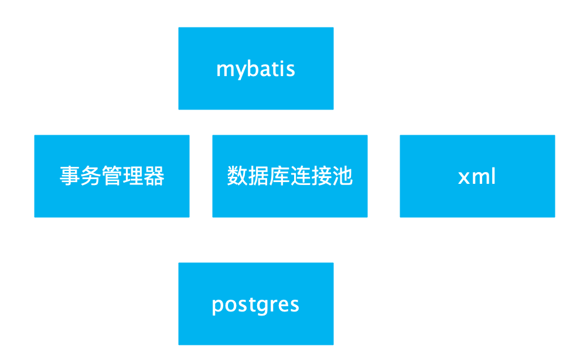

MyBbatis使用了**JDK动态代理**机制，动态为**接口**生成了代理类。

org.apache.ibatis.binding：Mybatis关于包装Mapper的代码

MapperRegistry ：注册Mapper接口、获取代理类实例

SqlSession .getMapper

Configuration .<T>getMapper

MapperRegistry .getMapper //获取生成的代理对象

MapperProxyFactory：创建Mapper代理对象的工厂

MapperProxy实现了JDK的动态代理接口 InvocationHandler


在原生jdbc中，我们要执行一个sql语句，它的流程是这样的：

\1. 注册驱动；

\2. 获取jdbc连接；

\3. 创建参数化预编译SQL；

\4. 绑定参数；

\5. 发送SQL给数据库进行执行；

\6. 对于查询，获取结果集到应用；

同样的，在mybatis中，要执行sql语句，首先要拿到代表JDBC底层连接的一个对象，这在mybatis中的实现就是SqlSession。


XML 头部的声明，它用来验证 XML 文档的正确性



## Mybatis启动过程


## 缓存

事务性查询缓存机制

本地的会话缓存：默认情况下启动，它仅仅对一个会话中的数据进行缓存。 

全局的二级缓存：

二级缓存是事务性的。这意味着，当 SqlSession 完成并提交时，或是完成并回滚，但没有执行 flushCache=true 的 insert/delete/update 语句时，缓存会获得更新。

在你的 SQL 映射文件xml中添加一行：

```xml
<cache/>
```

使用Java api时，使用 @CacheNamespaceRef 注解指定缓存作用域。


- 映射语句文件中的所有 select 语句的结果将会被缓存。（映射语句文件中）
- 映射语句文件中的所有 insert、update 和 delete 语句会刷新缓存。
- 缓存会使用最近最少使用算法（LRU, Least Recently Used）算法来清除不需要的缓存。
  - `LRU` – 最近最少使用：移除最长时间不被使用的对象。（默认）
  - `FIFO` – 先进先出：按对象进入缓存的顺序来移除它们。
  - `SOFT` – 软引用：基于垃圾回收器状态和软引用规则移除对象。
  - `WEAK` – 弱引用：更积极地基于垃圾收集器状态和弱引用规则移除对象。
- 缓存不会定时进行刷新（也就是说，没有刷新间隔）。
- 缓存会保存列表或对象（无论查询方法返回哪种）的 1024 个引用。
- 缓存会被视为读/写缓存，这意味着获取到的对象并不是共享的，可以安全地被调用者修改，而不干扰其他调用者或线程所做的潜在修改。

# 参考

[官方中文文档](https://mybatis.org/mybatis-3/zh/getting-started.html)

[Mybatis中Mapper动态代理的实现原理](https://blog.csdn.net/xiaokang123456kao/java/article/details/76228684)

[Mybatis入门.md](http://note.youdao.com/noteshare?id=a33f3b495b2c74fb5b60c69b2f379844&sub=C3AE0CC1B2AB462DAA40DD43A2392B91)

[Mybatis3源码分析(16)-Sql解析执行-结果集映射(ResultSetHandler)](https://blog.csdn.net/ashan_li/article/details/50379458)

[mybatis 3.x源码深度解析与最佳实践](https://www.cnblogs.com/zhjh256/p/8512392.html#4.2.1-获取opensession)

[《深入理解mybatis原理》 MyBatis的架构设计以及实例分析](https://blog.csdn.net/luanlouis/article/details/40422941)

[debug源码之mybatis](https://blog.csdn.net/a412451848/article/details/82723754)

[了解Mybatis的工作原理吗？](https://mp.weixin.qq.com/s/ursxCIUIFkVpnxu4qJanfQ)

