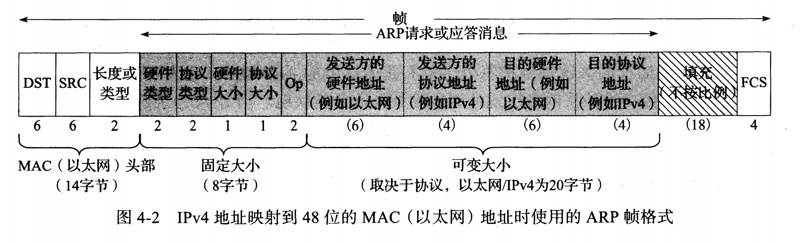

ARP是地址解析协议，用于确定IP地址对应的硬件地址，提供从网络层地址到相关硬件地址的动态映射。它在数据报的目的地与发送方处于同一子网时使用。

ARP向在一个共享的链路层网段上的所有主机发送一个ARP请求（链路层广播），ARP请求包含目的主机的IP地址。如果某个系统使用请求中指出的IP地址，它响应一个ARP应答。这个应答包含请求的IP地址和对应的MAC地址。

ARP缓存是其高效运行的基础。它在每个主机和路由器上维护了ARP缓存。该缓存使用地址解析为每个接口维护从网络层地址到硬件地址的最新映射。

RARP协议提供ARP反向映射。

ARP帧格式如下

