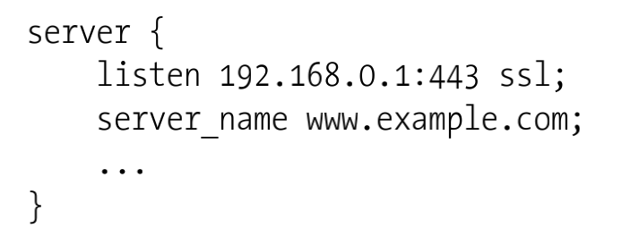
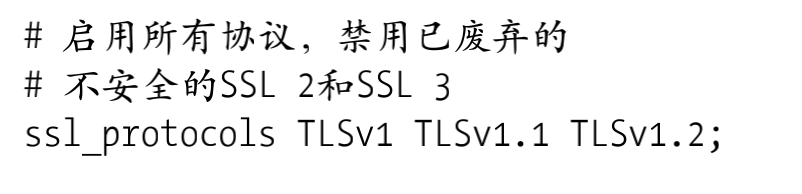
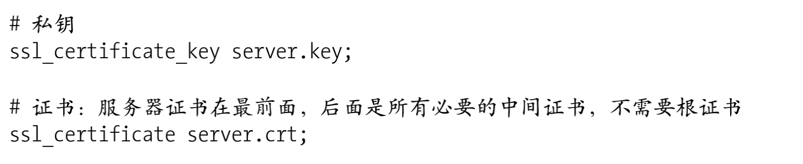
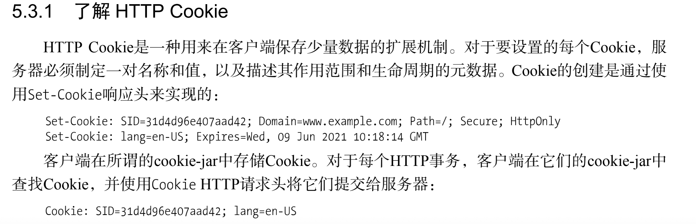

所有连接到互联网的设备都依赖SSL、TLS协议保护传输的信息。SSL/TLS用于TCP协议之上，HTTP之下。是传输层之上最流行的安全协议。

SSL 安全套接字层（secure socket layer）是TLS的前身。TLS 传输层安全 （transport layer security）：TLS 1.0（1999）、TLS1.1（2004）、TLS1.2（2008）

Nginx怎么启动TLS

1、listen指令后加ssl参数，在指定的端口上启动ssl协议。

2、配置TLS协议版本

3、配置密钥和证书

HTTP Cookie是一种用来在客户端保存少量数据的扩展机制。服务器通过使用Set-Cookie响应头来创建Cookie。服务器为每个Cookie指定制定一对名称和值，以及描述其作用范围和生命周期的元数据。客户端在cookie-jar中存储Cookie，对于每个HTTP事务，客户端在它们的cookie-jar中查找Cookie，并在Cookie HTTP请求头中将它们提交给服务器。

