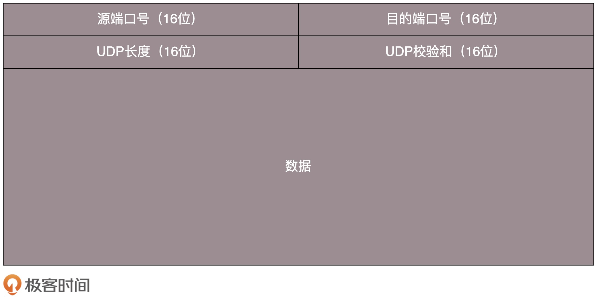
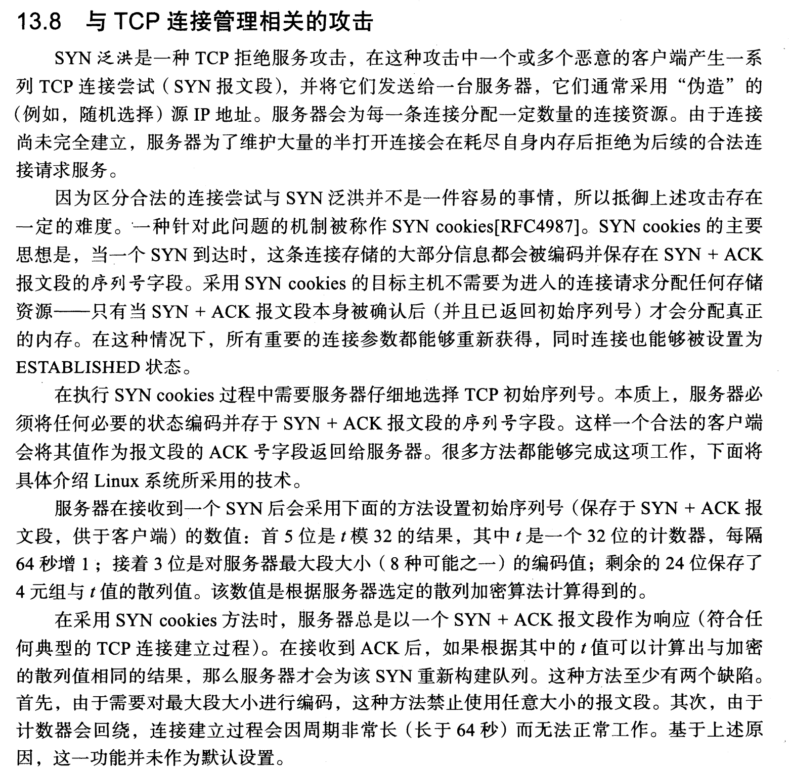

[TOC]

## UDP：用户数据报协议

UDP是一种面向数据报的传输层协议。UDP的特点是：需要资源少，不用维护连接，可以广播，处理速度快，时延低。
UDP的使用场景有：
1、在网络情况比较好的内网，或者对于丢包不敏感的应用 。如DHCP、TFTP。
2、不需要一对一沟通，建立连接，而是可以广播的应用 。如IGMP、VXLAN。
3、需要处理速度快，时延低（UDP没有拥塞控制，可由应用自己实现），可以容忍少数丢包，但是要求即便网络拥塞，也毫不退缩，一往无前的时候。

### UDP使用的五个例子

1. 网页或者 APP 的访问

   QUIC（全称 Quick UDP Internet Connections，快速 UDP 互联网连接）：降低网络通信的延迟，提供更好的用户互动体验。自己实现快速连接建立、减少重传时延，自适应拥塞控制

2. 流媒体的协议

   RTMP：基于TCP

   基于 UDP 实现自己的视频传输协议。

3. 实时游戏

   游戏有一个特点，就是实时性比较高。采用自定义的可靠 UDP 协议，自定义重传策略，能够把丢包产生的延迟降到最低，尽量减少网络问题对游戏性造成的影响。

4. IoT 物联网

5. 移动通信领域

## TCP：传输控制协议

> TCP是一个面向连接的协议。TCP提供一种面向连接的、可靠的字节流服务。发送数据之前，必须在双方之间建立一条连接。TCP通过以下方式提供可靠性：
>
> 1、应用数据被分割成TCP认为最适合发送的数据块。数据报（报文段、段）长度保持不变。
>
> 2、超时（确认超时）、重传；当TCP发出一个段后，它启动一个定时器，等待目的端确认收到这个报文段。如果不能及时收到一个确认，将重发这个报文段。
>
> 3、发送数据的确认。推迟几秒
>
> 4、TCP保持它首部和数据的检验和；这是一个端到端的检验和，目的是检测数据在传输过程中的任何变化。如果收到段的检验和有差错，TCP将丢弃这个报文段和不确认收到此报文段。
>
> 5、如果有必要，数据重排序后交给应用层。（序号）；TCP给发送的每一个包进行编号，接收方对数据包进行排序，把有序数据传送给应用层。
>
> 6、丢弃重复数据；TCP的接收端会丢弃重复的数据。
>
> 7、流量控制，TCP缓存空间；TCP连接的每一方都有固定大小的缓冲空间，TCP的接收端只允许发送端发送接收端缓冲区能接纳的数据。当接收方来不及处理发送方的数据，能提示发送方降低发送的速率，防止包丢失。TCP使用的流量控制协议是可变大小的滑动窗口协议。
>
> 8、拥塞控制：当网络拥塞时，减少数据的发送。 

### TCP报文段结构

### 三次握手建立连接

> 握手前，客户端和服务端的tcp状态都是closed，
>
> 
>
> 1）首先由客户端发起一个SYN报文段（主动打开）。报文段中SYN=1，指明服务器的端口，设置初始序号ISN。
>
> 2）然后服务端发回一个SYN报文段作为应答（被动打开）。SYN=1，服务端初始序号ISN，确认序号（ack）为客户端的ISN + 1，
>
> 3）最后客户端对服务端的SYN报文段进行确认。确认序号（ack）为服务端的ISN + 1.

为什么不是2次握手？为什么不是4次握手？双方消息有去有回（发送了SYN和ack），基本就可以了，多次无用。

TCP序号确认：起始序号ISN随时间变化，一个32位计数器每4ms加一

一开始，客户端和服务端都处于 CLOSED 状态。

先是服务端主动监听某个端口，处于 LISTEN 状态。

然后客户端主动发起连接 SYN，之后处于 SYN-SENT 状态。

服务端收到发起的连接，返回 SYN，并且 ACK 客户端的 SYN，之后处于 SYN-RCVD 状态。

客户端收到服务端发送的 SYN 和 ACK 之后，发送 ACK 的 ACK，之后处于 ESTABLISHED 状态，因为它一发一收成功了。

服务端收到 ACK 的 ACK 之后，处于 ESTABLISHED 状态，因为它也一发一收了。

### 四次挥手断开连接

由于TCP的半关闭造成的。TCP连接是全双工的（数据在两个方向上能同时传递），因此每个方向必须单独地进行关闭。

主动关闭

被动关闭

TCP的状态变迁图

### 流量控制

滑动窗口协议：允许发送方在停止并等待确认以前可以连续发送多个分组。

TCP缓冲区

窗口更新

提供的窗口：接收方通告的窗口

窗口合拢：数据被发送和确认时

窗口张开：读取已经确认的数据并释放了TCP的接收缓存时。

窗口收缩

零窗口

### 拥塞控制

#### 拥塞避免算法和慢启动算法

当发生超时和接收到重复的确认时，表示有分组丢失，意味着源主机和目的主机之间的某处网络发生了拥塞。

TCP通过拥塞避免和慢启动两个算法来进行拥塞控制。

拥塞避免算法和慢启动算法对每个连接维持两个变量：拥塞窗口 cwnd（字节）和慢启动门限ssthresh。

拥塞窗口表示发送端一次可以发送几个报文，而慢启动门限表示：以慢启动算法来增长拥塞窗口所能达到的阈值。

拥塞窗口 cwnd初始化为1个报文段，慢启动门限ssthresh初始化为 65535。

每收到一个ACK，拥塞窗口就增加一个报文段。也就是说，会成指数增加。防止把网络塞满。

拥塞发生时，ssthresh被设置为当前窗口大小的一半，最少为2个报文。如果为超时引起，则cwnd设置为1。

此时如果cwnd <= ssthresh 时则进行慢启动，然后转为拥塞避免。

拥塞避免算法要求每次收到一个确认时将cwnd增加 1 / cwnd，也就是说最多一个报文。

（发送方通过拥塞避免控制流量，接收方通过通告窗口控制流量。）

#### 快速重传、快速恢复

快速重传：如果一连串收到3个或3个以上的重复ACK，就非常可能是一个报文段丢失了。于是TCP就重传丢失的数据报，而无需等待超时时间定时器溢出。

快速恢复：接下来执行的不是慢启动算法而是拥塞避免算法。

3个重复的ACK，ssthresh = cwnd / 2，立刻重传， cwnd = ssthresh + 3 * 报文段大小

###  超时、重传 

TCP在发送时设置一个定时器，当定时器溢出时，还没有收到确认，它就重传该数据。

TCP管理的4个定时器

重传定时器：希望收到另一端的确认

坚持定时器：使窗口大小信息保持不断流动

保活定时器：检测到一个空闲连接的另一端何时崩溃或重启

2MSL定时器：测量一个连接处于TIME_WAIT状态的时间

指数避退：重传间隔1 3 6 12 24 48 64s。

往返时间RTT测量，根据RTT改变超时时间

重传多义性问题：不能确定重传数据的ACK，对应的是重传还是第一次。

### 坚持定时器（persist timer）

###保活定时器（Keepalive timer）

## TCP 和 UDP 有哪些区别？

| TCP                                                          | UDP                        |
| ------------------------------------------------------------ | -------------------------- |
| 面向连接 （需要维护连接，复杂）                              | 无连接（支持广播，简单）   |
| 通信前，通过三次握手建立连接。即在客户端和服务端建立一定的数据结构，维护双方的交互状态。结束时，四次握手。 |                            |
| 数据无差错、不丢失、不重复、有序                             | 不保证不丢失，不保证有序。 |
| 字节流                                                       | 数据报                     |
| 拥塞控制                                                     | （勇往直前）               |
| 有状态（包头中有状态位）                                     | 无状态                     |

## TCP状态转换图/有限状态机

 

## TIME_WAIT状态

TIME_WAIT状态也称为2MSL等待状态。在该状态中，TCP将会等待两倍于最大段生存期（MSL）的时间。当TCP执行一个主动关闭并发送最终的ACK时，连接处于TIME_WAIT状态。

为什么要等待2MSL:

1. 当被动关闭方由于没有收到FIN的ACK确认而重传FIN时，能够让主动关闭方重新发送最终的ACK。如果主动关闭方直接进入CLOSED状态则不行。 （主动关闭的一方，能否在被动关闭一方发布fin后等待2msl的时间）
2. 当TCP处于TIME_WAIT状态时，通信双方将该连接定义为不可重新使用（客户服务器的ip地址和端口）。当连接处于2MSL等待状态时，任何延迟到达的报文段都将被丢弃。

## 与TCP连接管理相关的攻击

SYN泛洪是一种TCP拒绝服务攻击，恶意客户端产生一系列TCP连接尝试。即不断发送三次握手建立连接时客户端主动发起的SYN报文段。服务器会为每一条连接分配一定数量的连接资源。由于连接尚未完全建立，服务器为了维护大量的半打开连接会在耗尽自身内存后拒绝为后续的合法连接请求服务。

SYN cookies是解决此问题的一种机制。当一个SYN到达时，这条连接存储的大部分信息都会被编码并保存在SYN + ACK报文段的序列号字段。采用SYN cookies的目标主机不需要为进入的连接请求分配任何存储资源。只有当SYN+ACK报文段本身被确认后，才会分配真正的内存。

## 

## 思考题

1. 如果让你实现一个类似于tcp的协议，为了保证可靠性你会怎么实现。
2. 为什么TCP可以保证顺序的传输，如果ACK丢失了，TCP进行怎样的修复操作

## 参考

[第10讲 | UDP协议：因性善而简单，难免碰到“城会玩”](https://time.geekbang.org/column/article/8924?utm_source=pinpaizhuanqu&utm_medium=geektime&utm_campaign=guanwang&utm_term=guanwang&utm_content=0511)

《TCP/IP详解 卷1:协议》

[ImportNew 把TCP/IP讲绝了！](https://mp.weixin.qq.com/s/3KPCJcyrMAObUq42unQMrg)

