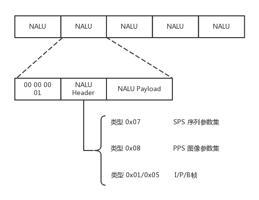
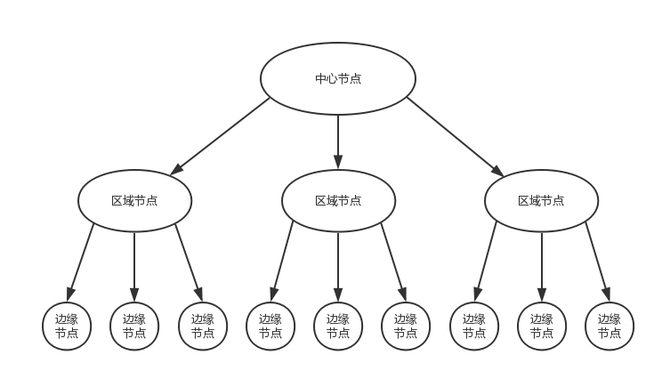

[TOC]

## 在浏览器（Web browser）的地址栏URL到看到网页发了什么

涉及到的协议：DNS、HTTP、TCP、IP

客户端、服务器端分层传输：封装、首部

总体来说分为以下几个过程:

1. DNS解析
2. TCP连接
3. 发送HTTP请求
4. 服务器处理请求并返回HTTP报文
5. 浏览器解析渲染页面
6. 连接结束

- 输入URL ： www.baidu.com

- 浏览器
  - 网址格式检查
  - 默认使用http协议
  - 通过代理访问国外网站、或者公司内网资源
- DNS解析，获取服务器IP地址
  - 从DNS Cache中解析 （某些网站IP会变，有时候需要清理本地缓存）
  - 从本地硬盘host文件中解析 (在/etc/hosts/中)
  - 从DNS服务器解析8.8.8.8 （Google提供的免费DNS服务器地址）
    - 通过UDP协议查询：IP + 发送端口 + 接收端口
    - IP层：IP路由表，ARP协议获取网关的Mac地址
    - 出Gateway
    - 互联网
    - 从DNS域名系统的根服务器“.”解析。根域名服务器全球一共多少台？13台
    - 根服务器给出com的IP，从com处解析域名
- 通过TCP 3次握手与服务器建立连接。 目的端口号80，源端口号：浏览器
- 浏览器发送http请求消息，http server 返回 HTTP Redirect 消息
- 浏览器将消息通过TLS负责传输：TLS确保消息内容保密、无法篡改、替换。目的端口号443
  - TLS与TLS服务器确认，版本（1.2）、认证算法、加密算法、数据校验算法、随机码 、数字证书（nginx ？）
  - TLS服务器返回证书
  - 浏览器通过预先安装的可信任根证书列表 中对应证书的公钥解密证书。检查证书有效期、是否被吊销

### 参考

[在浏览器地址栏输入一个URL后回车，背后会进行哪些技术步骤？](https://www.zhihu.com/question/34873227)
http://blog.jobbole.com/84870/

《图解HTTP》

讲一下CDN

Http的持久连接，Keep-Alive

## 如果是用抖音刷视频呢，从刷到看到发生了什么？  （点播）

音频

视频

混音

## 直播

- 应用场景：直播电商、直播教育、直播答题

- 名词系列一：AVI、MPEG、RMVB、MP4、MOV、FLV、WebM、WMV、ASF、MKV。

- 名词系列二：H.261、 H.262、H.263、H.264、H.265。要重点关注 H.264。

- 名词系列三：MPEG-1、MPEG-2、MPEG-4、MPEG-7。
- 帧：一张图片
  - I 帧，也称关键帧。里面是完整的图片，只需要本帧数据，就可以完成解码。
  - P 帧，前向预测编码帧。P 帧表示的是这一帧跟之前的一个关键帧（或 P 帧）的差别，解码时需要用之前缓存的画面，叠加上和本帧定义的差别，生成最终画面。
  - B 帧，双向预测内插编码帧。B 帧记录的是本帧与前后帧的差别。要解码 B 帧，不仅要取得之前的缓存画面，还要解码之后的画面，通过前后画面的数据与本帧数据的叠加，取得最终的画面。
- 帧率（FPS）：每秒帧的数目。
- 像素、RBG

为什么要编码：用尽量少的Bits数保存视频。减少存储和带宽压力。

之所以能够对视频流中的图片进行压缩，因为视频和图片有这样一些特点。

- 空间冗余：

  图像的相邻像素之间有较强的相关性，一张图片相邻像素往往是渐变的，不是突变的，没必要每个像素都完整地保存，可以隔几个保存一个，中间的用算法计算出来。

- 时间冗余：

  视频序列的相邻图像之间内容相似。一个视频中连续出现的图片也不是突变的，可以根据已有的图片进行预测和推断。

- 视觉冗余：

  人的视觉系统对某些细节不敏感，因此不会每一个细节都注意到，可以允许丢失一些数据。

- 编码冗余：

  不同像素值出现的概率不同，概率高的用的字节少，概率低的用的字节多，类似霍夫曼编码（Huffman Coding）的思路。

### 视频编码的两大流派

流派一：ITU（International Telecommunications Union）的 VCEG（Video Coding Experts Group），这个称为国际电联下的 VCEG。既然是电信，可想而知，他们最初做视频编码，主要侧重传输。名词系列二，就是这个组织制定的标准。

流派二：ISO（International Standards Organization）的 MPEG（Moving Picture Experts Group），这个是 ISO 旗下的 MPEG，本来是做视频存储的。例如，编码后保存在 VCD 和 DVD 中。当然后来也慢慢侧重视频传输了。名词系列三，就是这个组织制定的标准。

后来，ITU-T（国际电信联盟电信标准化部门，ITU Telecommunication Standardization Sector）与 MPEG 联合制定了 H.264/MPEG-4 AVC

视频流编码 -》 网络协议 -〉推送 -》流媒体服务端 -〉接流 -》转码（适配各种不同客户端） -〉分发 -》边缘节点 -》 客户端拉流 -〉 解码 —》播放 

### 编码

网络提取层单元（NALU，Network Abstraction Layer Unit）

### 推流

RTMP 协议（基于TCP）：TCP连接 + RTMP连接

### 分发

CDN 分发系统的架构

防盗链

HTTP 头的 referer 字段，告诉服务器是从哪个页面链接过来的

时间戳防盗链

## 会议

### 参考

[第16讲 | 流媒体协议：如何在直播里看到美女帅哥？](https://time.geekbang.org/column/article/9688?utm_source=pinpaizhuanqu&utm_medium=geektime&utm_campaign=guanwang&utm_term=guanwang&utm_content=0511)

[当前疫情下火爆的直播应用，你了解背后的技术架构吗？](https://mp.weixin.qq.com/s/j83tA9T5GmKt9gU8ps-ZGw)

[第20讲 | CDN：你去小卖部取过快递么？](https://time.geekbang.org/column/article/10085?utm_source=pinpaizhuanqu&utm_medium=geektime&utm_campaign=guanwang&utm_term=guanwang&utm_content=0511)

